<a id="top"></a>
# Aurora Translator 项目架构 / Aurora Translator Project Architecture

[中文](#zh) | [English](#en)

<a id="zh"></a>
## 中文

[English](#en) | [返回顶部](#top)

本文档说明 Aurora Translator 当前的项目级架构。现在项目以 `SemanticBoard` 为唯一统一中间模型，主叙事是：

- `AEDB -> SemanticBoard -> AuroraDB / 其他目标`
- `ODB++ -> SemanticBoard -> AuroraDB / 其他目标`
- `BRD -> SemanticBoard -> AuroraDB / 其他目标`
- `ALG -> SemanticBoard -> AuroraDB / 其他目标`
- `AuroraDB -> SemanticBoard -> 其他目标`

格式内部的字段细节仍以各自目录下的文档为准。

## 设计目标

Aurora Translator 的核心目标是把不同 PCB/封装相关数据源解析成稳定、可校验、可追踪版本的源格式对象，再统一进入 `SemanticBoard`，最后导出目标格式文件。JSON payload 继续保留，但默认作为调试、对拍和归档能力，而不是主流程依赖。

当前架构遵循几个原则：

- **源/语义/目标分层**：`sources/*` 只负责输入格式解析，`semantic/*` 只负责统一语义，`targets/*` 只负责目标格式导出。
- **格式忠实优先**：每个输入格式先保留自己的高保真输出模型，例如 `AEDBLayout`、`AuroraDBModel`、`ODBLayout`、`BRDLayout`、`ALGLayout`。
- **统一转换只走 `SemanticBoard`**：跨格式转换统一通过 `SemanticBoard` 提供，不做源格式之间的直接耦合导出。
- **语义层独立**：semantic 模块消费格式对象或格式 JSON，生成统一 PCB 语义对象，不反向污染格式模型。
- **schema 可生成**：机器可读 JSON schema 由模型生成或由模型定义维护，并跟随格式级 schema 版本。
- **版本分层**：项目版本、格式解析器版本、格式 JSON schema 版本分开管理。
- **重计算放底层**：对 ODB++、BRD 和 ALG 这类结构化解析任务，底层使用 Rust 解析核心，并同时暴露 PyO3 native 模块和 CLI；Python 负责项目集成、模型校验、文档和 CLI 编排。
- **AAF 只作为 AuroraDB target 的内部过渡格式**：它仍然支持 inspect/compile，但不再作为顶层架构的中心。

## 总体结构

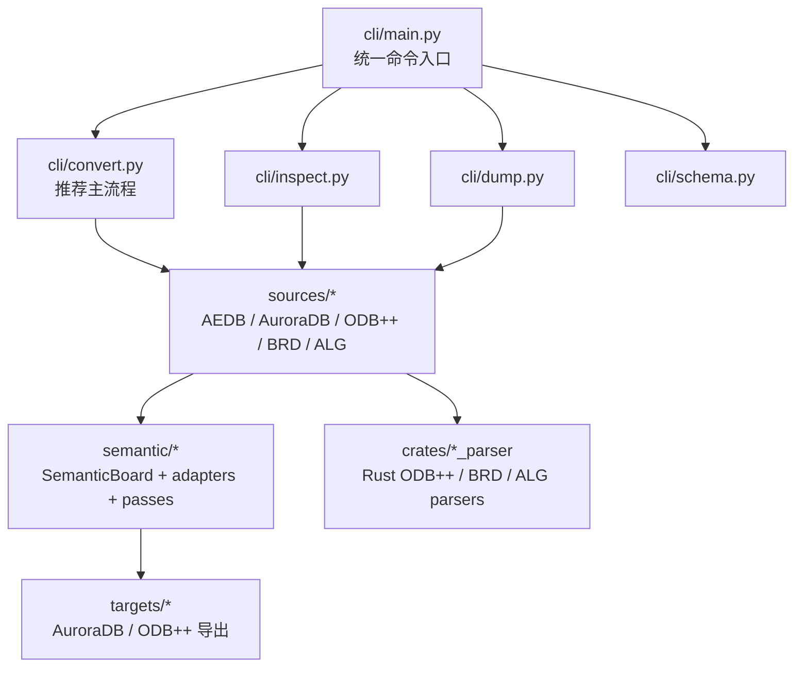

## 包职责

| 目录 | 职责 |
| --- | --- |
| `sources/aedb/` | AEDB 源解析、PyEDB 会话管理、extractor、schema 和格式级变更记录。 |
| `sources/auroradb/` | AuroraDB 源读取、block/model、inspect/diff、schema 和格式级文档。 |
| `sources/odbpp/` | ODB++ Python 集成层，优先调用 Rust native 模块，必要时回退到 CLI，校验 `ODBLayout` 并导出 schema/coverage。 |
| `sources/brd/` | Cadence Allegro BRD Python 集成层，优先调用 Rust native 模块，必要时回退到 CLI，校验 `BRDLayout` 并导出 schema。 |
| `sources/alg/` | Cadence Allegro extracta ALG Python 集成层，优先调用 Rust native 模块，必要时回退到 CLI，校验 `ALGLayout` 并导出 schema。 |
| `semantic/` | 统一 `SemanticBoard`、格式 adapter、连接图和语义诊断。 |
| `targets/auroradb/` | `SemanticBoard -> AuroraDB` 导出链路；AAF 只作为内部中间层或显式导出产物；`exporter.py` 只做顶层编排，`plan.py` 保存导出索引，`direct.py` 保存 direct AuroraDB builder 状态，`layout.py` 保存 `layout.db` / `design.layout` 写出，`parts.py` 保存 `parts.db` / `design.part` 写出和 part/footprint plan，`geometry.py` 保存 shape / via / trace / polygon geometry 命令与 payload，`stackup.py` 保存 stackup planning/serialization，`formatting.py` 保存单位/数值/旋转格式化 helper，`names.py` 保存命名和 AAF quoting helper。 |
| `targets/odbpp/` | `SemanticBoard -> ODB++` Python target wrapper，负责把 Semantic JSON 交给 Rust `odbpp_exporter` CLI 并接入 `convert --to odbpp`。 |
| `pipeline/` | `source -> semantic -> target` 主流程编排。 |
| `shared/` | 日志、性能统计、JSON 输出等共享工具。 |
| `crates/odbpp_parser/` | Rust ODB++ 解析核心，同时提供 CLI 和 PyO3 native 模块，负责读取目录/归档和解析 ODB++ 文本记录；summary-only、显式 step 和默认 auto-step details 路径会跳过非必要明细文件。 |
| `crates/odbpp_exporter/` | Rust ODB++ target exporter，读取 `SemanticBoard` JSON 并写出 deterministic ODB++ 目录结构；`writer.rs` 作为模块入口，`writer/entity.rs`、`writer/features.rs`、`writer/attributes.rs`、`writer/components.rs`、`writer/package.rs`、`writer/eda_data.rs`、`writer/netlist.rs`、`writer/formatting.rs` 和 `writer/model.rs` 分别承载 entity 编排、feature records、attribute tables/layer attrlist、component records、EDA package records、EDA data、cadnet netlist、ODB++ 命名/格式化和 Semantic 输入模型。 |
| `crates/brd_parser/` | Rust Allegro BRD 二进制解析核心，同时提供 CLI 和 PyO3 native 模块，负责解析 header、string table、对象块摘要和已建模的板级对象。 |
| `crates/alg_parser/` | Rust Allegro extracta ALG 文本解析核心，同时提供 CLI 和 PyO3 native 模块，负责流式解析 section header、board、layer、component、pin、padstack、pad、via、track、symbol 和 outline 记录。 |
| `cli/` | 新的 `convert / inspect / dump / schema` 命令，以及保留的兼容命令。 |
| `docs/` | 项目级文档和项目级变更记录。格式级文档放在各自的 `*/docs/` 下。 |

项目根目录本身通过 `pyproject.toml` 映射为 `aurora_translator` 主包；当前代码统一按 `sources / semantic / targets / pipeline / shared` 组织。

## CLI 路由

顶层入口是 `aurora_translator.cli:main`，本地开发常用：

```powershell
uv run python .\main.py ...
```

当前路由规则：

| 命令 | 入口 | 说明 |
| --- | --- | --- |
| `main.py <path-to-board.aedb>` | `cli/main.py` | 默认 AEDB 解析路径。 |
| `main.py --print-schema` | `cli/main.py` | 输出 AEDB JSON schema。 |
| `main.py convert ...` | `cli/convert.py` | 推荐主流程，直接走 `source -> SemanticBoard -> target`，当前 target 包含 `aaf`、`auroradb` 和 `odbpp`。 |
| `main.py inspect ...` | `cli/inspect.py` | inspect source / AAF。 |
| `main.py dump ...` | `cli/dump.py` | 显式导出 source JSON / semantic JSON。 |
| `main.py schema ...` | `cli/schema.py` | 统一导出 schema。 |
| `main.py auroradb ...` | `cli/auroradb.py` | 兼容 AuroraDB inspect/export/schema/diff/AAF 派生命令。 |
| `main.py odbpp ...` | `cli/odbpp.py` | 兼容 ODB++ parse/schema/to-auroradb 命令。 |
| `main.py semantic ...` | `cli/semantic.py` | 兼容 semantic from-json/from-source/source-to-aaf/source-to-auroradb/to-aaf/to-auroradb/schema 命令。 |

## AEDB 解析链路

AEDB 解析完全在 Python 侧完成，依赖 PyEDB 的本地 `.NET` 后端。

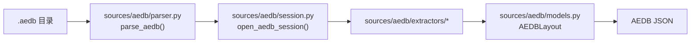

关键点：

- `sources/aedb/session.py` 负责打开和关闭 PyEDB 会话。
- `sources/aedb/extractors/layout.py` 负责组织各领域 extractor 并构建 payload。
- `sources/aedb/models.py` 是 AEDB JSON 结构的权威定义。
- `AEDBLayout.model_json_schema()` 生成机器可读 schema。
- `convert --from aedb --to auroradb` 在未请求 `--source-output` / `--semantic-output` 时会自动使用 `auroradb-minimal` 解析 profile，只保存 AuroraDB 导出必需字段和运行时私有几何缓存，减少 path / polygon 解析时间。
- 显式导出 AEDB JSON 或 Semantic JSON 时始终使用完整 `full` profile；也可以用 `--aedb-parse-profile full` 强制关闭自动最小化解析。

## AuroraDB 解析链路

AuroraDB 解析保留两种视图：原始 block tree 和结构化 Pydantic 模型。AAF 是 AuroraDB 的输入子模块，不是独立顶层格式。

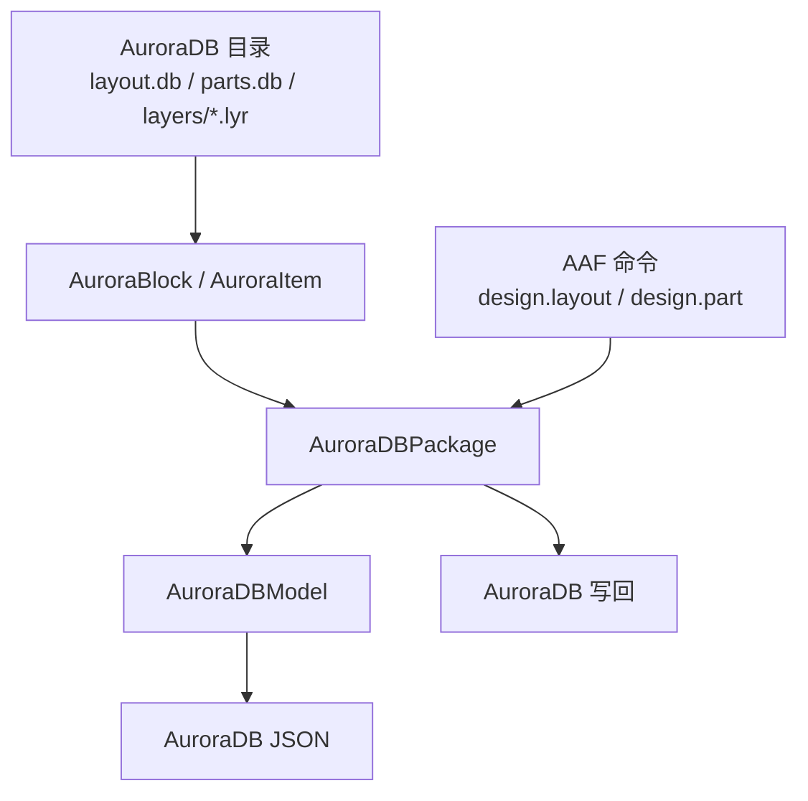

更细的 AuroraDB 内部架构见：[sources/auroradb/docs/architecture.md](../sources/auroradb/docs/architecture.md)。

## ODB++ 解析链路

ODB++ 解析采用 Rust + Python 的双层结构。

当前 ODB++ 解析和语义映射优先参考官方 `ODB++Design Format Specification Release 8.1 Update 4, August 2024`（[PDF](https://odbplusplus.com//wp-content/uploads/sites/2/2024/08/odb_spec_user.pdf)，[Resources](https://odbplusplus.com/design/our-resources/)）。

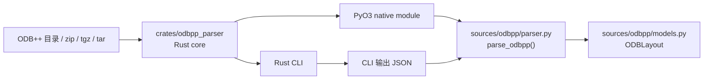

Rust 侧负责：

- 读取 ODB++ 目录、`.zip`、`.tgz`、`.tar.gz`、`.tar`。
- 识别 product root。
- 解析 `matrix/matrix`、`steps/<step>/profile`、layer `features`、layer `tools`、component records、EDA package definitions、net records。
- 保留 ODB++ feature index、feature ID、surface contour、symbol library features、drill/rout tools、EDA package pin 和 package geometry、组件 pin、组件 PRP 属性，以及 EDA net 引用关系（`FID` feature 连接、`SNT TOP T/B` pin 连接和 FID 上的 pin 上下文）。
- 通过共享解析核心向 CLI 输出 JSON payload，并向 PyO3 暴露 Python 可直接消费的对象结构。

Python 侧负责：

- 优先导入 `aurora_odbpp_native`，未安装时再查找或接收 `odbpp_parser.exe` 路径。
- 注入 `PROJECT_VERSION`、`ODBPP_PARSER_VERSION`、`ODBPP_JSON_SCHEMA_VERSION`。
- 校验 Rust 输出为 `ODBLayout`。
- 写入 JSON，导出 Pydantic schema，并按需生成转换覆盖率报告。

当前 Rust parser 已覆盖核心文件结构，以及 ODB++ 到 Semantic 转换所需的主要连接关系。ODB++ layer `attrlist`、package definitions 和 drill tools 已能支撑 stackup material/thickness 提取、component footprint 回退、完整 package body footprint 发布、via layer span 和 drill 顶层 metadata；Semantic adapter 还会根据匹配到的 signal-layer pad 和 negative pad antipad 细化 via template，并按 `I`/`H` contour polarity 拆分 surface polygon。ODB++ contour `OC` arc 现在会经 Semantic 导出为 AuroraDB `Parc` polygon 边；ODB++ 保留无网络名（如 `$NONE$`）会映射为 AuroraDB `NoNet` keyword；位于可布线层的正极性无 net trace/arc/polygon primitive 会提升为 `NoNet` 几何。非布线绘图 feature 仍只保留在 coverage 中。超出直接 via antipad 匹配的更复杂 negative/void 组合、thermal 约束、soldermask/paste 语义和完整 material library 重建仍属于后续增量工作。

## BRD 解析链路

Cadence Allegro BRD 解析采用 Rust + Python 双层结构。当前 Rust parser 是维护入口；历史 C++ reference 已移除，字段对齐以 `crates/brd_parser/`、BRD case fixtures 和 changelog 记录为准。输出模型保持为本项目自有的 `BRDLayout` source JSON。

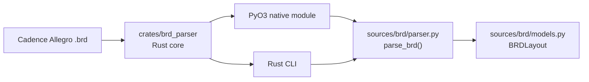

当前 BRD parser 覆盖 header、string table、linked-list metadata、layer list、net、padstack component 几何表、footprint、placed pad、via、track、segment、shape、keepout、text 和 block summary。`semantic.adapters.brd` 会把物理 ETCH layer、net、padstack pad/barrel 形状、placed pad bbox、component / pin / footprint、padstack via template、via、track/shape segment 链和 keepout void 映射进 `SemanticBoard`，从而支撑 AuroraDB 的走线、铜皮 polygon、偏心 slot via 和 `PolygonHole` 输出。

## ALG 解析链路

Cadence Allegro extracta ALG 解析采用 Rust + Python 双层结构。ALG 输入是由 Cadence extracta 从 `.brd` 导出的文本记录，输出模型为本项目自有的 `ALGLayout` source JSON。

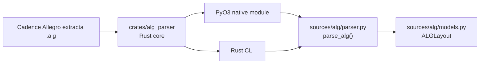

当前 ALG parser 覆盖 board、layer、component、component pin、logical pin、composite pad、full geometry pad/via/track/outline、net 和 symbol section，并保留 track 的 `GRAPHIC_DATA_10` 几何角色。`semantic.adapters.alg` 会把 conductor layer、net、component/package、pin、component pad、via template、via、CONNECT trace/arc、SHAPE polygon、VOID polygon hole 和 board extents 映射进 `SemanticBoard`，从而支撑直接 AuroraDB 输出。对于存在逻辑 pin 但缺少铜皮 pad 几何的 extracta 记录，adapter 会保留 pin 并生成默认 pad，同时写入 info 级 diagnostic。

## Altium 解析链路

Altium Designer `.PcbDoc` 解析采用 Rust + Python 双层结构。输入是二进制 Microsoft Compound File 容器中的 Altium PCB stream，输出模型为本项目自有的 `AltiumLayout` source JSON。

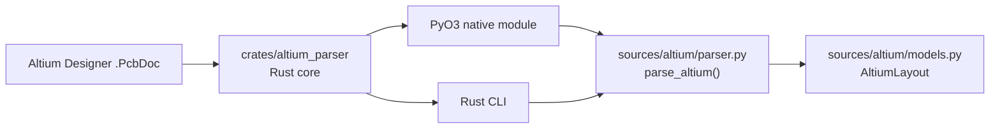

当前 Altium parser 覆盖 `.PcbDoc` CFB 容器、`FileHeader`、`Board6`、`Nets6`、`Classes6`、`Rules6`、`Components6`、`Pads6`、`Vias6`、`Tracks6`、`Arcs6`、`Fills6`、`Regions6`、`ShapeBasedRegions6`、`Polygons6`、`Texts6` 和 `WideStrings6`。`semantic.adapters.altium` 会把铜层、net、component/footprint、pad/pin、via template、via、trace、arc、fill、region、polygon 和 board outline 映射进 `SemanticBoard`。当前输入范围是二进制 `.PcbDoc`；`.PrjPcb`、`.SchDoc`、`.PcbLib` 和 Altium ASCII PCB 文件不是本解析器入口。

## Semantic 语义链路

Semantic 层既可以消费已经导出的格式 JSON，也可以直接消费内存中的格式对象，并生成统一语义对象：

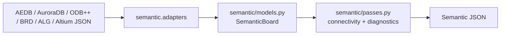

当前 semantic 模型包含 layer、material、shape、via template、net、component、footprint、pin、pad、via、primitive、board outline/profile geometry、connectivity 和 diagnostics。footprint、via template、pad、via、primitive 和 board outline 的 `geometry` 已收敛为 typed hint model，并保留 `extra` escape hatch 来承载源格式 metadata；下游仍通过 `.get()` 读取声明字段或兼容 metadata。每个对象都有 `SourceRef`，可以追踪回源格式字段。语义层本身只保留统一模型和 adapter/pass；Aurora/AAF / AuroraDB 目标导出实现收敛到 `targets/auroradb/`，ODB++ 目标导出通过 `targets/odbpp/` 调用 Rust `crates/odbpp_exporter/`。AuroraDB 导出链默认会把统一模型中的叠层、材料、shape、via template、component、pin、带 net trace、带 net arc、带 net polygon、board outline 和 footprint body 语义直接写成 AuroraDB 输出目录中的 `layout.db`、`parts.db`、`layers/`，并保留 `stackup.dat`、`stackup.json`；只有显式要求时才额外保留 `aaf/design.layout`、`aaf/design.part`。其中 signal/plane layer 会进入 AuroraDB metal layer 结构，dielectric layer 会进入 stackup 文件。ODB++ exporter 写出 matrix、step profile、layer features、layer attrlist、components、EDA package/net data 和 cadnet netlist。对于来自 AEDB 的语义 payload，当原始 AEDB component transform 不能保留规范化 footprint 朝向时，Aurora/AAF exporter 还会基于 pad 拓扑反推 component placement rotation，并按需拆分 part/footprint variant。

更细的 semantic 内部架构见：[semantic/docs/architecture.md](../semantic/docs/architecture.md)。

## JSON Schema 与文档

| 格式 | schema | 双语字段说明 | 变更记录 |
| --- | --- | --- | --- |
| AEDB | `sources/aedb/docs/aedb_schema.json` | `sources/aedb/docs/aedb_json_schema.md` | `sources/aedb/docs/CHANGELOG.md`、`sources/aedb/docs/SCHEMA_CHANGELOG.md` |
| AuroraDB | `sources/auroradb/docs/auroradb_schema.json` | `sources/auroradb/docs/auroradb_json_schema.md` | `sources/auroradb/docs/CHANGELOG.md`、`sources/auroradb/docs/SCHEMA_CHANGELOG.md` |
| ODB++ | `sources/odbpp/docs/odbpp_schema.json` | `sources/odbpp/docs/odbpp_json_schema.md` | `sources/odbpp/docs/CHANGELOG.md`、`sources/odbpp/docs/SCHEMA_CHANGELOG.md` |
| BRD | 通过 `main.py schema --format brd` 生成 | 暂无长期字段说明 | 项目级 `docs/CHANGELOG.md` |
| ALG | 通过 `main.py schema --format alg` 生成 | 暂无长期字段说明 | 项目级 `docs/CHANGELOG.md` |
| Altium | 通过 `main.py schema --format altium` 生成 | 暂无长期字段说明 | 项目级 `docs/CHANGELOG.md` |
| Semantic | `semantic/docs/semantic_schema.json` | `semantic/docs/semantic_json_schema.md` | `semantic/docs/CHANGELOG.md`、`semantic/docs/SCHEMA_CHANGELOG.md` |

常用 schema 生成命令：

```powershell
uv run python .\main.py --schema-output .\sources\aedb\docs\aedb_schema.json
uv run python .\main.py auroradb schema -o .\sources\auroradb\docs\auroradb_schema.json
uv run python .\main.py odbpp schema -o .\sources\odbpp\docs\odbpp_schema.json
uv run python .\main.py schema --format alg -o .\out\alg_schema.json
uv run python .\main.py schema --format altium -o .\out\altium_schema.json
uv run python .\main.py semantic schema -o .\semantic\docs\semantic_schema.json
```

## 版本管理

版本分三层：

| 层级 | 常量 | 作用 |
| --- | --- | --- |
| 项目版本 | `version.PROJECT_VERSION` | 表示整个 Aurora Translator 的发布版本。 |
| 格式解析器版本 | `AEDB_PARSER_VERSION` / `AURORADB_PARSER_VERSION` / `ODBPP_PARSER_VERSION` / `BRD_PARSER_VERSION` / `ALG_PARSER_VERSION` / `ALTIUM_PARSER_VERSION` | 表示某个格式解析逻辑、性能或集成方式的版本。 |
| 格式 JSON schema 版本 | `AEDB_JSON_SCHEMA_VERSION` / `AURORADB_JSON_SCHEMA_VERSION` / `ODBPP_JSON_SCHEMA_VERSION` / `BRD_JSON_SCHEMA_VERSION` / `ALG_JSON_SCHEMA_VERSION` / `ALTIUM_JSON_SCHEMA_VERSION` | 表示某个格式 JSON 输出契约的版本。 |
| Semantic 版本 | `SEMANTIC_PARSER_VERSION` / `SEMANTIC_JSON_SCHEMA_VERSION` | 表示语义转换逻辑和 semantic JSON 输出契约的版本。 |

JSON payload 中统一输出：

```json
{
  "metadata": {
    "project_version": "...",
    "parser_version": "...",
    "output_schema_version": "..."
  }
}
```

变更原则：

- 只改实现、不改输出字段：更新对应格式的 parser version。
- 改 JSON 字段、字段含义或结构：更新对应格式的 JSON schema version。
- 项目级发布或整合格式级变更：更新 `PROJECT_VERSION` 和 `docs/CHANGELOG.md`。

当前版本：

| 项 | 版本 |
| --- | --- |
| Project | `1.0.44` |
| AEDB parser | `0.4.56` |
| AEDB JSON schema | `0.5.0` |
| AuroraDB parser | `0.2.13` |
| AuroraDB JSON schema | `0.2.0` |
| ODB++ parser | `0.6.3` |
| ODB++ JSON schema | `0.6.0` |
| BRD parser | `0.1.6` |
| BRD JSON schema | `0.5.0` |
| ALG parser | `0.1.1` |
| ALG JSON schema | `0.2.0` |
| Altium parser | `0.1.0` |
| Altium JSON schema | `0.1.0` |
| Semantic parser | `0.7.10` |
| Semantic JSON schema | `0.7.2` |

## 开发和构建

Python 侧常用检查：

```powershell
uv run python -m compileall sources targets pipeline shared semantic cli tests
uv run ruff format --check .
uv run ruff check .
uv run python -m unittest discover -s tests
uv run python .\main.py schema --format odbpp -o .\sources\odbpp\docs\odbpp_schema.json
uv run python .\main.py schema --format semantic -o .\semantic\docs\semantic_schema.json
```

Python 代码提交前应先运行 `uv run ruff format .`。Ruff formatter 是项目标准格式化工具，配置维护在 `pyproject.toml`。

Rust ODB++ parser 构建与 native 安装：

```powershell
cargo build --release --manifest-path .\crates\odbpp_parser\Cargo.toml
$env:PYO3_PYTHON = (Resolve-Path .\.venv\Scripts\python.exe).Path
$env:VIRTUAL_ENV = (Resolve-Path .\.venv).Path
$env:PATH = "$env:VIRTUAL_ENV\Scripts;$env:PATH"
uv tool run --from "maturin>=1.8,<2.0" maturin develop --uv --manifest-path .\crates\odbpp_parser\Cargo.toml --release --features python
```

Rust ODB++ exporter 检查：

```powershell
cargo test --manifest-path .\crates\odbpp_exporter\Cargo.toml
```

ODB++ 解析：

```powershell
uv run python .\main.py odbpp parse <odbpp-dir-or-archive> -o .\out\odbpp.json
```

如果要显式强制走 CLI，可以设置：

```powershell
$env:AURORA_ODBPP_PARSER = (Resolve-Path .\crates\odbpp_parser\target\release\odbpp_parser.exe).Path
```

## 新增格式的推荐步骤

新增一个 PCB 格式时，建议按以下顺序接入：

1. 新建源格式包，例如 `sources/ipc2581/` 或 `sources/gerber/`。
2. 定义格式自己的 Pydantic 输出模型和 `*_PARSER_VERSION`、`*_JSON_SCHEMA_VERSION`。
3. 实现解析入口，例如 `parse_ipc2581(...)`。
4. 增加 `cli/<format>.py` 子命令，并在 `cli/main.py` 路由。
5. 生成 `*/docs/<format>_schema.json`，并补齐一份中文在前、英文在后的双语字段说明。
6. 增加格式级 `CHANGELOG.md` 和 `SCHEMA_CHANGELOG.md`。
7. 需要跨格式转换时，再实现 `semantic/adapters/<format>.py` adapter。

这个顺序能让格式内部先稳定下来，再通过 semantic 层对外提供统一语义。

<a id="en"></a>
## English

[中文](#zh) | [Back to top](#top)

This document describes the current project-level architecture of Aurora Translator. The project now uses `SemanticBoard` as its single unified intermediate model, with these supported primary flows:

- `AEDB -> SemanticBoard -> AuroraDB / other targets`
- `ODB++ -> SemanticBoard -> AuroraDB / other targets`
- `BRD -> SemanticBoard -> AuroraDB / other targets`
- `ALG -> SemanticBoard -> AuroraDB / other targets`
- `AuroraDB -> SemanticBoard -> other targets`

Format-specific field details remain in each format's own documentation directory.

## Design Goals

Aurora Translator turns PCB and package-related data sources into stable, schema-checkable, version-traceable source-format objects, then normalizes them into `SemanticBoard`, and finally exports target-format files. JSON payloads remain available, but they are now treated as debug, comparison, and archival artifacts rather than the default runtime path.

The current architecture follows a few principles:

- **Source / semantic / target layering**: `sources/*` only parses inputs, `semantic/*` only owns the unified semantics, and `targets/*` only owns target-format export logic.
- **Format fidelity first**: each input format keeps a high-fidelity output model first, such as `AEDBLayout`, `AuroraDBModel`, `ODBLayout`, `BRDLayout`, or `ALGLayout`.
- **Unified conversion through `SemanticBoard`**: cross-format conversion goes through `SemanticBoard`; source formats do not export directly into each other.
- **Independent semantic layer**: the semantic module consumes format objects or format JSON and produces unified PCB objects without polluting format models.
- **Generated schemas**: machine-readable JSON schemas are generated from models or maintained by model definitions and are versioned at the format level.
- **Layered versioning**: project version, format parser version, and format JSON schema version are managed separately.
- **Heavy parsing at the lower layer**: ODB++, BRD, and ALG structured parsing is handled by Rust parser cores that expose both PyO3 native modules and CLIs; Python handles integration, validation, documentation, and CLI orchestration.
- **AAF is an AuroraDB target detail**: it is still supported for inspect/compile work, but it is no longer treated as a top-level architecture center.

## Overall Structure

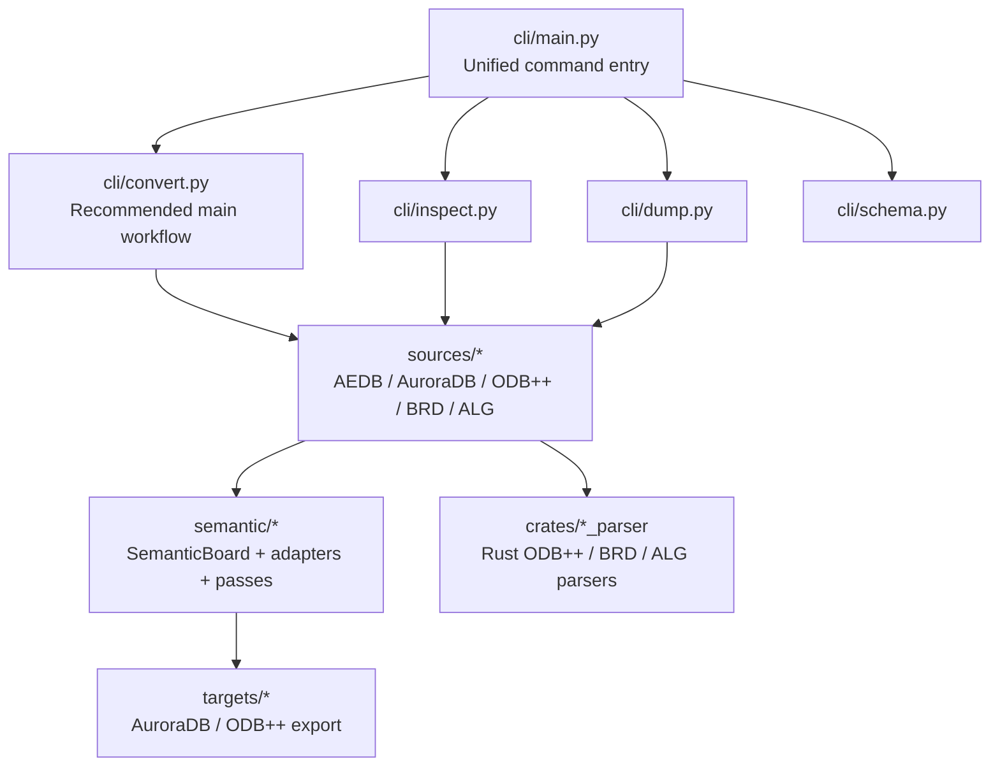

## Package Responsibilities

| Directory | Responsibility |
| --- | --- |
| `sources/aedb/` | AEDB source parsing, PyEDB session management, extractors, schema, and format-level changelogs. |
| `sources/auroradb/` | AuroraDB source reading, block/model handling, inspect/diff, schema, and format docs. |
| `sources/odbpp/` | ODB++ Python integration layer, native-first Rust parser invocation with CLI fallback, `ODBLayout` validation, schema export, and coverage helpers. |
| `sources/brd/` | Cadence Allegro BRD Python integration layer, native-first Rust parser invocation with CLI fallback, `BRDLayout` validation, and schema export. |
| `sources/alg/` | Cadence Allegro extracta ALG Python integration layer, native-first Rust parser invocation with CLI fallback, `ALGLayout` validation, and schema export. |
| `sources/altium/` | Altium Designer `.PcbDoc` Python integration layer, native-first Rust parser invocation with CLI fallback, `AltiumLayout` validation, and schema export. |
| `semantic/` | The unified `SemanticBoard`, format adapters, connectivity, and semantic diagnostics. |
| `targets/auroradb/` | The `SemanticBoard -> AuroraDB` export path, with AAF kept only as an internal or explicitly exported intermediate; `exporter.py` is now top-level orchestration only, `plan.py` owns export indexes, `direct.py` owns direct AuroraDB builder state, `layout.py` owns `layout.db` / `design.layout` emission, `parts.py` owns `parts.db` / `design.part` emission and part/footprint planning, `geometry.py` owns shape / via / trace / polygon geometry commands and payloads, `stackup.py` owns stackup planning/serialization, `formatting.py` owns unit / number / rotation formatting helpers, and `names.py` owns naming plus AAF quoting helpers. |
| `targets/odbpp/` | The `SemanticBoard -> ODB++` Python target wrapper, which serializes Semantic JSON for the Rust `odbpp_exporter` CLI and wires it into `convert --to odbpp`. |
| `pipeline/` | The `source -> semantic -> target` orchestration layer. |
| `shared/` | Shared logging, runtime metrics, JSON output, and utility helpers. |
| `crates/odbpp_parser/` | Rust ODB++ parser core, CLI, and PyO3 native module for directory/archive reading and ODB++ text record parsing; summary-only, explicit-step, and default auto-step detail paths skip unnecessary detail files. |
| `crates/brd_parser/` | Rust Allegro BRD binary parser core, CLI, and PyO3 native module for headers, string tables, block summaries, and modeled board objects. |
| `crates/alg_parser/` | Rust Allegro extracta ALG text parser core, CLI, and PyO3 native module for streaming section headers, boards, layers, components, pins, padstacks, pads, vias, tracks, symbols, and outline records. |
| `crates/altium_parser/` | Rust Altium Designer `.PcbDoc` parser core, CLI, and PyO3 native module for CFB traversal and modeled PCB streams. |
| `crates/odbpp_exporter/` | Rust ODB++ target exporter that reads `SemanticBoard` JSON and writes a deterministic ODB++ directory; `writer.rs` is the module entry point, with `writer/entity.rs`, `writer/features.rs`, `writer/attributes.rs`, `writer/components.rs`, `writer/package.rs`, `writer/eda_data.rs`, `writer/netlist.rs`, `writer/formatting.rs`, and `writer/model.rs` owning entity orchestration, feature records, attribute tables/layer attrlists, component records, EDA package records, EDA data, cadnet netlists, ODB++ naming/formatting, and the Semantic input model. |
| `cli/` | The new `convert / inspect / dump / schema` entrypoints plus compatibility commands. |
| `docs/` | Project-level documentation and project-level changelogs. Format-level documents live under each `*/docs/` directory. |

The repository root is mapped as the `aurora_translator` package by `pyproject.toml`. The codebase now lives under `sources / semantic / targets / pipeline / shared`.

## CLI Routing

The top-level entry point is `aurora_translator.cli:main`. During local development, the common form is:

```powershell
uv run python .\main.py ...
```

Current routing:

| Command | Entry Point | Description |
| --- | --- | --- |
| `main.py <path-to-board.aedb>` | `cli/main.py` | Default AEDB parsing path. |
| `main.py --print-schema` | `cli/main.py` | Print the AEDB JSON schema. |
| `main.py convert ...` | `cli/convert.py` | Recommended main path: `source -> SemanticBoard -> target`; current targets are `aaf`, `auroradb`, and `odbpp`. |
| `main.py inspect ...` | `cli/inspect.py` | Inspect source files or AAF files. |
| `main.py dump ...` | `cli/dump.py` | Explicitly export source JSON or semantic JSON. |
| `main.py schema ...` | `cli/schema.py` | Export machine-readable schemas. |
| `main.py auroradb ...` | `cli/auroradb.py` | Compatibility AuroraDB inspect/export/schema/diff/AAF commands. |
| `main.py odbpp ...` | `cli/odbpp.py` | Compatibility ODB++ parse/schema/to-auroradb commands. |
| `main.py semantic ...` | `cli/semantic.py` | Compatibility semantic from-json/from-source/source-to-aaf/source-to-auroradb/to-aaf/to-auroradb/schema commands. |

## AEDB Parsing Flow

AEDB parsing runs entirely on the Python side and depends on PyEDB's local `.NET` backend.

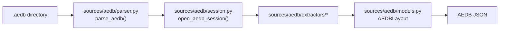

Key points:

- `sources/aedb/session.py` opens and closes the PyEDB session.
- `sources/aedb/extractors/layout.py` coordinates domain extractors and builds the payload.
- `sources/aedb/models.py` is the authoritative definition of the AEDB JSON structure.
- `AEDBLayout.model_json_schema()` generates the machine-readable schema.
- `convert --from aedb --to auroradb` automatically uses the `auroradb-minimal` parse profile when neither `--source-output` nor `--semantic-output` is requested; it keeps only fields and runtime-private geometry caches required by AuroraDB export to reduce path / polygon parse time.
- Explicit AEDB JSON or Semantic JSON export always uses the complete `full` profile. Pass `--aedb-parse-profile full` to force full parsing on direct AuroraDB conversion.

## AuroraDB Parsing Flow

AuroraDB parsing keeps two views: the raw block tree and a structured Pydantic model. AAF is an AuroraDB input submodule, not a separate top-level format.

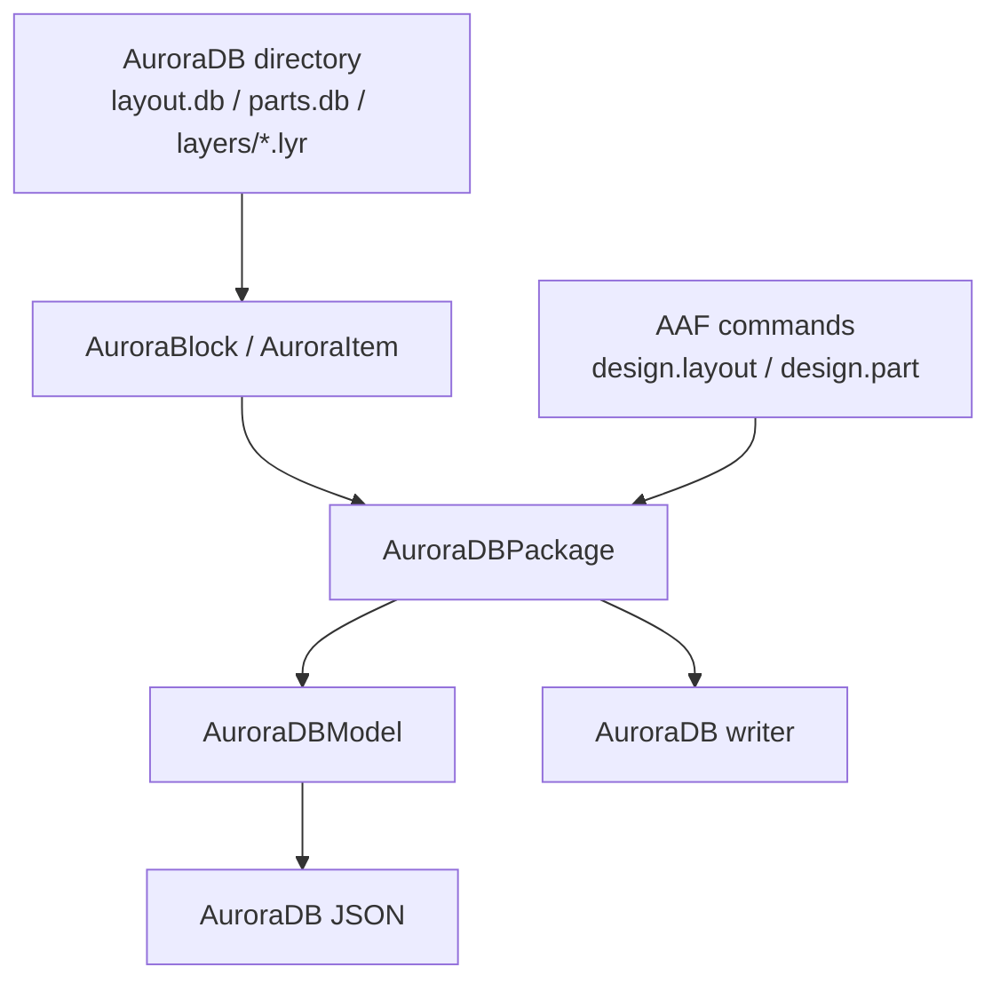

See [sources/auroradb/docs/architecture.md](../sources/auroradb/docs/architecture.md) for the detailed AuroraDB architecture.

## ODB++ Parsing Flow

ODB++ parsing uses a Rust + Python two-layer structure.

ODB++ parsing and semantic mapping currently use the official `ODB++Design Format Specification Release 8.1 Update 4, August 2024` as the primary reference ([PDF](https://odbplusplus.com//wp-content/uploads/sites/2/2024/08/odb_spec_user.pdf), [Resources](https://odbplusplus.com/design/our-resources/)).

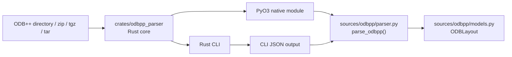

The Rust side is responsible for:

- Reading ODB++ directories, `.zip`, `.tgz`, `.tar.gz`, and `.tar` archives.
- Detecting the product root.
- Parsing `matrix/matrix`, `steps/<step>/profile`, layer `features`, layer `tools`, component records, EDA package definitions, and net records.
- Preserving ODB++ feature indices, feature IDs, surface contours, symbol-library features, drill/rout tools, EDA package pins and package geometry, component pins, component PRP properties, and EDA net references (`FID` feature links, `SNT TOP T/B` pin links, and pin context on FID records).
- Emitting JSON through the CLI path and Python-consumable object graphs through the PyO3 native path.

The Python side is responsible for:

- Importing `aurora_odbpp_native` when available, otherwise locating or accepting an `odbpp_parser.exe` path.
- Injecting `PROJECT_VERSION`, `ODBPP_PARSER_VERSION`, and `ODBPP_JSON_SCHEMA_VERSION`.
- Validating Rust output as `ODBLayout`.
- Writing JSON, exporting the Pydantic schema, and generating optional conversion coverage reports.

The current Rust parser covers the core file structure plus the connectivity data needed for ODB++ to Semantic conversion. ODB++ layer `attrlist` files, package definitions, and drill tools are parsed enough for stackup material/thickness extraction, component footprint fallback, full package-body footprint publication, via layer spans, and top-level drill metadata. The Semantic adapter also refines via templates from matched signal-layer pads and negative pad antipads, splits surface polygons by `I`/`H` contour polarity, preserves ODB++ contour `OC` arcs through Semantic export as AuroraDB `Parc` polygon edges, maps ODB++ reserved no-net names such as `$NONE$` to the AuroraDB `NoNet` keyword, and promotes positive no-net trace/arc/polygon primitives on routable layers into `NoNet` geometry. Non-routable drawing features remain coverage-only. More complex negative/void composition beyond direct via antipad matching, thermal constraints, soldermask/paste semantics, and full material-library reconstruction remain incremental parser work.

## BRD Parsing Flow

Cadence Allegro BRD parsing uses a Rust + Python two-layer structure. The Rust parser is now the maintained entrypoint; the historical C++ reference has been removed, and field alignment is tracked through `crates/brd_parser/`, BRD case fixtures, and changelog entries. Output remains this project's own `BRDLayout` source JSON.


The current BRD parser covers headers, string tables, linked-list metadata, layer lists, nets, padstack component geometry tables, footprints, placed pads, vias, tracks, segments, shapes, keepouts, texts, and block summaries. `semantic.adapters.brd` maps physical ETCH layers, nets, padstack pad/barrel shapes, placed-pad bounding boxes, components / pins / footprints, padstack via templates, vias, track/shape segment chains, and keepout voids into `SemanticBoard`, supporting AuroraDB output for routing, copper polygons, eccentric slot vias, and `PolygonHole` geometry.

## ALG Parsing Flow

Cadence Allegro extracta ALG parsing uses a Rust + Python two-layer structure. ALG inputs are text records exported from `.brd` files by Cadence extracta, and the output is this project's own `ALGLayout` source JSON.


The current ALG parser covers board, layer, component, component-pin, logical-pin, composite-pad, full-geometry pad/via/track/outline, net, and symbol sections, and preserves each track record's `GRAPHIC_DATA_10` geometry role. `semantic.adapters.alg` maps conductor layers, nets, components/packages, pins, component pads, via templates, vias, CONNECT traces/arcs, SHAPE polygons, VOID polygon holes, and board extents into `SemanticBoard`, supporting direct AuroraDB output. For extracta records that have logical pins but no copper pad geometry, the adapter keeps the pin, creates a default pad, and emits an info-level diagnostic.

## Altium Parsing Flow

Altium Designer `.PcbDoc` parsing uses a Rust + Python two-layer structure. Input is an Altium PCB stream set inside a binary Microsoft Compound File container, and the output model is the project-owned `AltiumLayout` source JSON.


The current Altium parser covers the `.PcbDoc` CFB container, `FileHeader`, `Board6`, `Nets6`, `Classes6`, `Rules6`, `Components6`, `Pads6`, `Vias6`, `Tracks6`, `Arcs6`, `Fills6`, `Regions6`, `ShapeBasedRegions6`, `Polygons6`, `Texts6`, and `WideStrings6`. `semantic.adapters.altium` maps copper layers, nets, components/footprints, pads/pins, via templates, vias, traces, arcs, fills, regions, polygons, and board outline into `SemanticBoard`. The current input scope is binary `.PcbDoc`; `.PrjPcb`, `.SchDoc`, `.PcbLib`, and Altium ASCII PCB files are not parser entrypoints.

## Semantic Flow

The Semantic layer can consume either exported format JSON or in-memory format objects and generate unified semantic objects:


The current semantic model includes layers, materials, shapes, via templates, nets, components, footprints, pins, pads, vias, primitives, board outline/profile geometry, connectivity, and diagnostics. Footprint, via-template, pad, via, primitive, and board-outline `geometry` fields now use typed hint models with an `extra` escape hatch for source-format metadata; downstream code can still read declared fields and compatible metadata through `.get()`. Every object has a `SourceRef` that can trace it back to the source-format field. The semantic layer itself now focuses on the unified model plus adapters and passes, while the actual Aurora/AAF / AuroraDB target export implementation has been moved into `targets/auroradb/`; ODB++ target export goes through `targets/odbpp/` and Rust `crates/odbpp_exporter/`. By default, the AuroraDB target path writes `layout.db`, `parts.db`, `layers/`, `stackup.dat`, and `stackup.json` directly into the AuroraDB output directory; `aaf/design.layout` and `aaf/design.part` are kept only when requested explicitly. Signal/plane layers enter the AuroraDB metal-layer structure, while dielectric layers stay in the stackup files. The ODB++ exporter writes matrix, step profile, layer features, layer attrlists, components, EDA package/net data, and cadnet netlists. For AEDB-derived payloads, the Aurora/AAF exporter also infers component placement rotation and part/footprint variants from pad topology when the raw AEDB component transform does not preserve canonical footprint orientation.

See [semantic/docs/architecture.md](../semantic/docs/architecture.md) for the detailed semantic architecture.

## JSON Schema And Documents

| Format | Schema | Bilingual Field Guide | Changelogs |
| --- | --- | --- | --- |
| AEDB | `sources/aedb/docs/aedb_schema.json` | `sources/aedb/docs/aedb_json_schema.md` | `sources/aedb/docs/CHANGELOG.md`, `sources/aedb/docs/SCHEMA_CHANGELOG.md` |
| AuroraDB | `sources/auroradb/docs/auroradb_schema.json` | `sources/auroradb/docs/auroradb_json_schema.md` | `sources/auroradb/docs/CHANGELOG.md`, `sources/auroradb/docs/SCHEMA_CHANGELOG.md` |
| ODB++ | `sources/odbpp/docs/odbpp_schema.json` | `sources/odbpp/docs/odbpp_json_schema.md` | `sources/odbpp/docs/CHANGELOG.md`, `sources/odbpp/docs/SCHEMA_CHANGELOG.md` |
| BRD | Generated by `main.py schema --format brd` | No long-lived field guide yet | Project-level `docs/CHANGELOG.md` |
| ALG | Generated by `main.py schema --format alg` | No long-lived field guide yet | Project-level `docs/CHANGELOG.md` |
| Altium | Generated by `main.py schema --format altium` | No long-lived field guide yet | Project-level `docs/CHANGELOG.md` |
| Semantic | `semantic/docs/semantic_schema.json` | `semantic/docs/semantic_json_schema.md` | `semantic/docs/CHANGELOG.md`, `semantic/docs/SCHEMA_CHANGELOG.md` |

Common schema generation commands:

```powershell
uv run python .\main.py --schema-output .\sources\aedb\docs\aedb_schema.json
uv run python .\main.py auroradb schema -o .\sources\auroradb\docs\auroradb_schema.json
uv run python .\main.py odbpp schema -o .\sources\odbpp\docs\odbpp_schema.json
uv run python .\main.py schema --format alg -o .\out\alg_schema.json
uv run python .\main.py schema --format altium -o .\out\altium_schema.json
uv run python .\main.py semantic schema -o .\semantic\docs\semantic_schema.json
```

## Version Management

Versioning has three layers:

| Layer | Constants | Purpose |
| --- | --- | --- |
| Project version | `version.PROJECT_VERSION` | Overall Aurora Translator release version. |
| Format parser version | `AEDB_PARSER_VERSION` / `AURORADB_PARSER_VERSION` / `ODBPP_PARSER_VERSION` / `BRD_PARSER_VERSION` / `ALG_PARSER_VERSION` / `ALTIUM_PARSER_VERSION` | Version for a specific format's parsing logic, performance behavior, or integration path. |
| Format JSON schema version | `AEDB_JSON_SCHEMA_VERSION` / `AURORADB_JSON_SCHEMA_VERSION` / `ODBPP_JSON_SCHEMA_VERSION` / `BRD_JSON_SCHEMA_VERSION` / `ALG_JSON_SCHEMA_VERSION` / `ALTIUM_JSON_SCHEMA_VERSION` | Version for a specific format's JSON output contract. |
| Semantic version | `SEMANTIC_PARSER_VERSION` / `SEMANTIC_JSON_SCHEMA_VERSION` | Version for semantic conversion logic and the semantic JSON output contract. |

JSON payloads consistently emit:

```json
{
  "metadata": {
    "project_version": "...",
    "parser_version": "...",
    "output_schema_version": "..."
  }
}
```

Change rules:

- Implementation changes without output field changes: update the corresponding format parser version.
- JSON field, field meaning, or structural changes: update the corresponding format JSON schema version.
- Project-level release or integrated format-level changes: update `PROJECT_VERSION` and `docs/CHANGELOG.md`.

Current versions:

| Item | Version |
| --- | --- |
| Project | `1.0.44` |
| AEDB parser | `0.4.56` |
| AEDB JSON schema | `0.5.0` |
| AuroraDB parser | `0.2.13` |
| AuroraDB JSON schema | `0.2.0` |
| ODB++ parser | `0.6.3` |
| ODB++ JSON schema | `0.6.0` |
| BRD parser | `0.1.6` |
| BRD JSON schema | `0.5.0` |
| ALG parser | `0.1.1` |
| ALG JSON schema | `0.2.0` |
| Altium parser | `0.1.0` |
| Altium JSON schema | `0.1.0` |
| Semantic parser | `0.7.10` |
| Semantic JSON schema | `0.7.2` |

## Development And Build

Common Python-side checks:

```powershell
uv run python -m compileall sources targets pipeline shared semantic cli tests
uv run ruff format --check .
uv run ruff check .
uv run python -m unittest discover -s tests
uv run python .\main.py schema --format odbpp -o .\sources\odbpp\docs\odbpp_schema.json
uv run python .\main.py schema --format semantic -o .\semantic\docs\semantic_schema.json
```

Before committing Python code, run `uv run ruff format .`. The Ruff formatter is the project-standard formatting tool and is configured in `pyproject.toml`.

Build the Rust ODB++ parser and install the native module:

```powershell
cargo build --release --manifest-path .\crates\odbpp_parser\Cargo.toml
$env:PYO3_PYTHON = (Resolve-Path .\.venv\Scripts\python.exe).Path
$env:VIRTUAL_ENV = (Resolve-Path .\.venv).Path
$env:PATH = "$env:VIRTUAL_ENV\Scripts;$env:PATH"
uv tool run --from "maturin>=1.8,<2.0" maturin develop --uv --manifest-path .\crates\odbpp_parser\Cargo.toml --release --features python
```

Rust ODB++ exporter checks:

```powershell
cargo test --manifest-path .\crates\odbpp_exporter\Cargo.toml
```

Parse ODB++:

```powershell
uv run python .\main.py odbpp parse <odbpp-dir-or-archive> -o .\out\odbpp.json
```

To force the CLI backend explicitly, set:

```powershell
$env:AURORA_ODBPP_PARSER = (Resolve-Path .\crates\odbpp_parser\target\release\odbpp_parser.exe).Path
```

## Recommended Steps For Adding A Format

When adding a new PCB format, use this sequence:

1. Add a source-format package, for example `sources/ipc2581/` or `sources/gerber/`.
2. Define the format's Pydantic output model and `*_PARSER_VERSION` / `*_JSON_SCHEMA_VERSION`.
3. Implement a parse entry point such as `parse_ipc2581(...)`.
4. Add `cli/<format>.py` and route it from `cli/main.py`.
5. Generate `*/docs/<format>_schema.json` and add one bilingual field guide with Chinese first and English second.
6. Add format-level `CHANGELOG.md` and `SCHEMA_CHANGELOG.md`.
7. Add a `semantic/adapters/<format>.py` adapter when cross-format conversion is needed.

This order lets each format stabilize internally before exposing it through the semantic layer.
