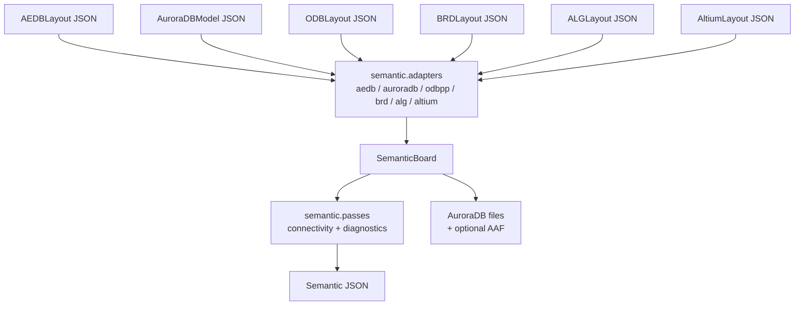

<a id="top"></a>
# Semantic 语义层架构 / Semantic Layer Architecture

[中文](#zh) | [English](#en)

<a id="zh"></a>
## 中文

[English](#en) | [返回顶部](#top)

Semantic 模块位于各格式解析器之上。AEDB、AuroraDB、ODB++、BRD、ALG 和 Altium 仍然保留各自的高保真格式对象，并可按需导出格式 JSON；Semantic 模块负责把这些格式对象或格式 JSON 转换成统一的板级语义模型，用于后续查询、比较、诊断和格式转换。真正的目标格式导出现在位于 `targets/*`，其中当前已实现的是 `targets/auroradb/` 和 `targets/odbpp/`。

## 设计边界

- 格式层负责“源格式中有什么”。
- Semantic 层负责“这些对象在 PCB 语义中是什么”。
- Semantic 层不反向修改 AEDB、AuroraDB、ODB++、BRD、ALG 或 Altium 的格式模型。
- 当前版本覆盖稳定公共概念：layer、material、shape、via template、net、component、footprint、pin、pad、via、primitive、connectivity edge 和 diagnostics。

## 数据流



## 模块结构

```text
semantic/
  models.py          # SemanticBoard 和相关 Pydantic 模型
  version.py         # semantic parser/schema 版本
  schema.py          # semantic JSON schema 导出
  converter.py       # 统一转换入口
  passes.py          # 语义推导 pass
  adapters/
    aedb.py          # AEDBLayout -> SemanticBoard
    auroradb.py      # AuroraDBModel -> SemanticBoard
    odbpp.py         # ODBLayout -> SemanticBoard
    brd.py           # BRDLayout -> SemanticBoard
    alg.py           # ALGLayout -> SemanticBoard
    altium.py        # AltiumLayout -> SemanticBoard
  docs/
    architecture.md
    format_mapping.md
    odbpp_to_semantic_mapping.md
    semantic_json_schema.md
    CHANGELOG.md
    SCHEMA_CHANGELOG.md

targets/auroradb/
  exporter.py        # SemanticBoard -> AuroraDB（AAF 为内部/显式导出中间层）
  writer.py          # AuroraDB block 文件写回
  aaf/
    parser.py
    executor.py
    translator.py
```

## 语义模型

顶层模型是 `SemanticBoard`：

```text
SemanticBoard
  metadata
  units
  summary
  layers
  materials
  shapes
  via_templates
  nets
  components
  footprints
  pins
  pads
  vias
  primitives
  connectivity
  diagnostics
```

每个语义对象都包含 `source`，用于追踪回源格式字段：

```json
{
  "source_format": "aedb",
  "path": "components[0].pins[1]",
  "raw_id": "123"
}
```

## Adapter 职责

Adapter 负责把源格式对象归一化为统一语义对象：

- AEDB adapter：归一化 materials、stackup layers、nets、components、footprints、pins、pads、padstack vias、paths、polygons 和 zone primitives。
- AuroraDB adapter：归一化 layout nets、metal layers、layer components、footprints、net pins、pads、net vias 和 net geometries。
- ODB++ adapter：归一化 matrix layers、layer attrlist material/thickness hint、drill spans、profile outline geometry、所有已解析 package footprint 与 body geometry、fallback pad geometry、component/package attributes、components、nets、保留无网络别名到 `NoNet` 的映射、selected-step features、无 net 绘图 primitive、独立 arc feature、drill tool hints、matched signal-layer via pads、`I`/`H` surface contour groups 和 contour `OC` arc 边。

复杂规则应放在 `passes.py` 或后续新增的 pass 中，避免 adapter 变成不可维护的推理集合。

## Aurora/AAF 转换包

`semantic to-aaf` 会从 `SemanticBoard` 生成 Aurora/AAF 转换包；`semantic to-auroradb` 会通过 `targets/auroradb/exporter.py` 直接把 AuroraDB 写到输出目录，并保留 `stackup.dat`、`stackup.json`。只有显式传入 `--export-aaf` 时，输出目录才会额外保留 `aaf/`。输出文件包括：

| 文件 | 内容 |
| --- | --- |
| `stackup.dat` | 面向 Aurora 叠层解析的文本叠层，包含 metal 与 dielectric layer。 |
| `stackup.json` | 结构化叠层和材料表，包含 dielectric 的 `eps_r`、`delta`、厚度和材料名。 |
| `layout.db` / `parts.db` / `layers/` | `to-auroradb` 默认直接生成的 AuroraDB block 文件。 |
| `aaf/design.layout` | AAF layout 命令，包含单位、轮廓、signal/plane layerstack、net 声明、component、pin pad 铜皮 placement、pin、via 和 net geometry；仅在显式导出 AAF 时保留。 |
| `aaf/design.part` | AAF library 命令，包含 part、part attribute、footprint、footprint pad template、footprint pin placement 和 part pin；仅在显式导出 AAF 时保留。 |

转换规则不是字段名对字段名的搬运，而是按 PCB 语义输出目标格式需要的内容：

| Semantic 内容 | Aurora/AAF 输出 |
| --- | --- |
| `SemanticMaterial` | `stackup.json.materials`，并作为 `stackup.dat` 中 layer 的材料属性来源。 |
| `SemanticShape` | `design.layout` 中的 `layout add -g`，编译后成为 AuroraDB `GeomSymbols/ShapeList`。 |
| Trace width | `design.layout` 中额外生成 Circle shape；trace 的 `Line` 和 `Larc` 通过 `-shape` 引用线宽 shape。 |
| `SemanticViaTemplate` | `design.layout` 中的 `layout add -via`，编译后成为 AuroraDB `GeomSymbols/ViaList`。 |
| `SemanticComponent` | `design.layout` 中的 component placement，编译后进入 AuroraDB layer components。 |
| `SemanticComponent.attributes` / `SemanticFootprint.attributes` | `design.part` 中 `library add -p` 的共享 part attribute，编译后成为 AuroraDB part attributes。 |
| `SemanticBoard.board_outline` | `design.layout` 中的 `layout set -profile` geometry，编译后成为 AuroraDB `Outline`。 |
| `SemanticFootprint.geometry` | `design.part` 中的 `library add -g ... -footprint`，编译后成为 footprint body geometry。 |
| 无 net 可绘图 primitive | 位于可布线层的正极性 trace/arc/polygon 会提升为 `NoNet` 并导出为 AuroraDB net geometry；非布线绘图 feature 仍只保留在 coverage 中。 |
| `SemanticPad` | `design.layout` 中的 pad 铜皮 shape placement，以及 `design.part` 中的 footprint pad placement。 |
| `SemanticPin` | `design.layout` 中的 net pin 连接，以及 `design.part` 中的 part pin 条目。 |
| `SemanticPrimitive.kind=trace/arc/polygon` | `design.layout` 中的 net geometry；trace 与独立 arc 输出为 `Larc`，polygon arc 边编译为 `Parc`，带 void 几何的 polygon 输出为 PolygonHole。 |
| `SemanticLayer.role=signal/plane` | `stackup.dat/json` 的 `Metal` layer，同时进入 `design.layout` 的 layerstack 和 AuroraDB metal layer。 |
| `SemanticLayer.role=dielectric` | `stackup.dat/json` 的 `Dielectric` layer，不写成 AuroraDB `MetalLayer`。 |
| `SemanticLayer.thickness` | 转换为 mil 后写入 `stackup.dat/json` 和 signal layerstack。 |
| `SemanticBoard.nets` | 写入 `design.layout` 的 net 声明。 |

当源数据缺少 solder mask 或两个 metal layer 之间缺少 dielectric 时，导出器会生成默认 dielectric layer，保持目标叠层结构可用。

## 连接图

当前版本提供以下 connectivity edge：

| edge kind | 含义 |
| --- | --- |
| `component-pin` | component 拥有 pin。 |
| `component-footprint` | component 关联 footprint。 |
| `component-pad` | component 拥有已放置 pad。 |
| `footprint-pad` | footprint 关联 pad。 |
| `pin-pad` | pin 绑定 pad。 |
| `pad-net` | pad 连接 net。 |
| `pin-net` | pin 连接 net。 |
| `via-net` | via 连接 net。 |
| `primitive-net` | primitive 连接 net。 |
| `component-primitive` | primitive 归属于 component。 |

诊断 pass 会检查已存在引用是否指向缺失对象，例如 pin、pad、footprint、net、layer、via 或 primitive 引用。后续可以增加几何相交、网络跨层、电源地分类等更深入的语义 pass。

## CLI

导出 schema：

```powershell
uv run python .\main.py semantic schema -o .\semantic\docs\semantic_schema.json
```

从格式对象或格式 JSON 生成 semantic JSON，或者直接从源格式输出 AAF / AuroraDB：

```powershell
uv run python .\main.py semantic from-json aedb .\out\board.json
uv run python .\main.py semantic from-json aedb .\out\board.json -o .\out --semantic-output board.semantic.json
uv run python .\main.py semantic from-json auroradb .\out\auroradb.json
uv run python .\main.py semantic from-json auroradb .\out\auroradb.json -o .\out --semantic-output auroradb.semantic.json
uv run python .\main.py semantic from-json odbpp .\out\odbpp.json
uv run python .\main.py semantic from-json odbpp .\out\odbpp.json -o .\out --semantic-output odbpp.semantic.json
uv run python .\main.py semantic from-source aedb <path-to-board.aedb>
uv run python .\main.py semantic from-source aedb <path-to-board.aedb> -o .\out --semantic-output board.semantic.json
uv run python .\main.py semantic from-source odbpp <odbpp-dir-or-archive>
uv run python .\main.py semantic from-source odbpp <odbpp-dir-or-archive> -o .\out --semantic-output odbpp.semantic.json
uv run python .\main.py semantic source-to-aaf aedb <path-to-board.aedb> -o .\out\aurora_aaf_from_aedb
uv run python .\main.py semantic source-to-auroradb odbpp <odbpp-dir-or-archive> -o .\out\auroradb_from_odbpp
uv run python .\main.py semantic to-aaf .\out\board.semantic.json -o .\out\aurora_aaf_from_semantic
uv run python .\main.py semantic to-auroradb .\out\board.semantic.json -o .\out\auroradb_from_semantic
```

对于 ODB++ 源路径，semantic CLI 默认优先使用 `aurora_odbpp_native` PyO3 模块；传入 `--rust-binary` 时会强制走 `odbpp_parser` CLI。

AEDB 到 semantic 的转换规则见：[aedb_to_semantic.md](aedb_to_semantic.md)；ODB++ 到 semantic 的字段级映射和旋转关系见：[odbpp_to_semantic_mapping.md](odbpp_to_semantic_mapping.md)；跨格式对象映射见：[format_mapping.md](format_mapping.md)。

## 版本边界

- `SEMANTIC_PARSER_VERSION`：语义转换、推导 pass 或诊断行为变化时更新。
- `SEMANTIC_JSON_SCHEMA_VERSION`：semantic JSON 字段、结构或字段含义变化时更新。
- `PROJECT_VERSION`：项目发布或集成语义层能力时更新。

<a id="en"></a>
## English

[中文](#zh) | [Back to top](#top)

The Semantic module sits above the format parsers. AEDB, AuroraDB, ODB++, BRD, ALG, and Altium keep their high-fidelity format objects and can optionally export format JSON payloads; the Semantic module converts those objects or payloads into one board-level semantic model for later querying, comparison, diagnostics, and format conversion. The actual target export implementations now live under `targets/*`, with `targets/auroradb/` and `targets/odbpp/` currently implemented.

## Design Boundaries

- The format layer describes what exists in the source format.
- The Semantic layer describes what those objects mean in PCB terms.
- The Semantic layer does not mutate AEDB, AuroraDB, ODB++, BRD, ALG, or Altium format models.
- The current version covers stable shared concepts: layer, material, shape, via template, net, component, footprint, pin, pad, via, primitive, connectivity edge, and diagnostics.

## Data Flow


## Module Structure

```text
semantic/
  models.py          # SemanticBoard and related Pydantic models
  version.py         # semantic parser/schema versions
  schema.py          # semantic JSON schema export
  converter.py       # unified conversion entry point
  passes.py          # semantic inference passes
  adapters/
    aedb.py          # AEDBLayout -> SemanticBoard
    auroradb.py      # AuroraDBModel -> SemanticBoard
    odbpp.py         # ODBLayout -> SemanticBoard
    brd.py           # BRDLayout -> SemanticBoard
    alg.py           # ALGLayout -> SemanticBoard
    altium.py        # AltiumLayout -> SemanticBoard
  docs/
    architecture.md
    format_mapping.md
    odbpp_to_semantic_mapping.md
    semantic_json_schema.md
    CHANGELOG.md
    SCHEMA_CHANGELOG.md

targets/auroradb/
  exporter.py        # SemanticBoard -> AuroraDB (AAF is an internal/explicitly exported intermediate)
  writer.py          # AuroraDB block-file writer
  aaf/
    parser.py
    executor.py
    translator.py
```

## Semantic Model

The top-level model is `SemanticBoard`:

```text
SemanticBoard
  metadata
  units
  summary
  layers
  materials
  shapes
  via_templates
  nets
  components
  footprints
  pins
  pads
  vias
  primitives
  connectivity
  diagnostics
```

Every semantic object includes `source` so it can be traced back to the source-format field:

```json
{
  "source_format": "aedb",
  "path": "components[0].pins[1]",
  "raw_id": "123"
}
```

## Adapter Responsibilities

Adapters normalize source-format objects into unified semantic objects:

- AEDB adapter: normalizes materials, stackup layers, nets, components, footprints, pins, pads, padstack vias, paths, polygons, and zone primitives.
- AuroraDB adapter: normalizes layout nets, metal layers, layer components, footprints, net pins, pads, net vias, and net geometries.
- ODB++ adapter: normalizes matrix layers, layer attrlist material/thickness hints, drill spans, profile outline geometry, all parsed package footprints and body geometry, fallback pad geometry, component/package attributes, components, nets, reserved no-net aliases mapped to `NoNet`, selected-step features, no-net drawing primitives, standalone arc features, drill tool hints, matched signal-layer via pads, `I`/`H` surface contour groups, and contour `OC` arc edges.

More complex rules should live in `passes.py` or future pass modules so adapters do not become unmaintainable inference bundles.

## Aurora/AAF Conversion Package

`semantic to-aaf` generates an Aurora/AAF conversion package from `SemanticBoard`; `semantic to-auroradb` writes AuroraDB directly into the output directory through `targets/auroradb/exporter.py` and keeps `stackup.dat` plus `stackup.json`. The `aaf/` directory is retained only when `--export-aaf` is passed explicitly. The outputs include:

| File | Content |
| --- | --- |
| `stackup.dat` | Text stackup for Aurora stackup parsing, including metal and dielectric layers. |
| `stackup.json` | Structured stackup and material table, including dielectric `eps_r`, `delta`, thickness, and material names. |
| `layout.db` / `parts.db` / `layers/` | AuroraDB block files written directly by `to-auroradb` by default. |
| `aaf/design.layout` | AAF layout commands for units, outline, signal/plane layerstack, net declarations, components, pin-pad copper placements, pins, vias, and net geometry; retained only when AAF export is requested explicitly. |
| `aaf/design.part` | AAF library commands for parts, part attributes, footprints, footprint pad templates, footprint pin placements, and part pins; retained only when AAF export is requested explicitly. |

The conversion is semantic content generation, not field-name copying:

| Semantic content | Aurora/AAF output |
| --- | --- |
| `SemanticMaterial` | `stackup.json.materials`, and the material-property source for stackup layer lines. |
| `SemanticShape` | `layout add -g` in `design.layout`, compiled into AuroraDB `GeomSymbols/ShapeList`. |
| Trace width | Additional Circle shapes in `design.layout`; trace `Line` and `Larc` commands reference these shapes by `-shape`. |
| `SemanticViaTemplate` | `layout add -via` in `design.layout`, compiled into AuroraDB `GeomSymbols/ViaList`. |
| `SemanticComponent` | Component placement in `design.layout`, compiled into AuroraDB layer components. |
| `SemanticComponent.attributes` / `SemanticFootprint.attributes` | Shared part attributes on `library add -p` in `design.part`, compiled into AuroraDB part attributes. |
| `SemanticBoard.board_outline` | `layout set -profile` geometry in `design.layout`, compiled into AuroraDB `Outline`. |
| `SemanticFootprint.geometry` | `library add -g ... -footprint` in `design.part`, compiled into footprint body geometry. |
| No-net drawable primitives | Positive trace/arc/polygon primitives on routable layers are promoted to `NoNet` and exported as AuroraDB net geometry; non-routable drawing features remain coverage-only. |
| `SemanticPad` | Pad copper shape placement in `design.layout` and footprint pad placement in `design.part`. |
| `SemanticPin` | Net-pin binding in `design.layout` and part pin entries in `design.part`. |
| `SemanticPrimitive.kind=trace/arc/polygon` | Net geometry in `design.layout`; trace and standalone arcs are emitted as `Larc`, polygon arc edges compile to `Parc`, and polygons with void geometry are emitted as PolygonHole. |
| `SemanticLayer.role=signal/plane` | `Metal` layers in `stackup.dat/json`, plus `design.layout` layerstack and AuroraDB metal layers. |
| `SemanticLayer.role=dielectric` | `Dielectric` layers in `stackup.dat/json`; these are not emitted as AuroraDB `MetalLayer` blocks. |
| `SemanticLayer.thickness` | Converted to mil and written to `stackup.dat/json` and signal layerstack entries. |
| `SemanticBoard.nets` | Net declarations in `design.layout`. |

When the source lacks solder mask layers or has adjacent metal layers without a dielectric between them, the exporter inserts default dielectric layers so the target stackup remains usable.

## Connectivity Graph

The current version provides these connectivity edges:

| Edge kind | Meaning |
| --- | --- |
| `component-pin` | A component owns a pin. |
| `component-footprint` | A component references a footprint. |
| `component-pad` | A component owns a placed pad. |
| `footprint-pad` | A footprint references a pad. |
| `pin-pad` | A pin is bound to a pad. |
| `pad-net` | A pad connects to a net. |
| `pin-net` | A pin connects to a net. |
| `via-net` | A via connects to a net. |
| `primitive-net` | A primitive connects to a net. |
| `component-primitive` | A primitive belongs to a component. |

The diagnostics pass checks whether existing references point to missing objects, such as pin, pad, footprint, net, layer, via, or primitive references. Future passes can add deeper semantics such as geometry intersection, cross-layer net propagation, and power/ground classification.

## CLI

Export schema:

```powershell
uv run python .\main.py semantic schema -o .\semantic\docs\semantic_schema.json
```

Generate semantic JSON from format objects or format JSON, or emit AAF / AuroraDB directly from source formats:

```powershell
uv run python .\main.py semantic from-json aedb .\out\board.json
uv run python .\main.py semantic from-json aedb .\out\board.json -o .\out --semantic-output board.semantic.json
uv run python .\main.py semantic from-json auroradb .\out\auroradb.json
uv run python .\main.py semantic from-json auroradb .\out\auroradb.json -o .\out --semantic-output auroradb.semantic.json
uv run python .\main.py semantic from-json odbpp .\out\odbpp.json
uv run python .\main.py semantic from-json odbpp .\out\odbpp.json -o .\out --semantic-output odbpp.semantic.json
uv run python .\main.py semantic from-source aedb <path-to-board.aedb>
uv run python .\main.py semantic from-source aedb <path-to-board.aedb> -o .\out --semantic-output board.semantic.json
uv run python .\main.py semantic from-source odbpp <odbpp-dir-or-archive>
uv run python .\main.py semantic from-source odbpp <odbpp-dir-or-archive> -o .\out --semantic-output odbpp.semantic.json
uv run python .\main.py semantic source-to-aaf aedb <path-to-board.aedb> -o .\out\aurora_aaf_from_aedb
uv run python .\main.py semantic source-to-auroradb odbpp <odbpp-dir-or-archive> -o .\out\auroradb_from_odbpp
uv run python .\main.py semantic to-aaf .\out\board.semantic.json -o .\out\aurora_aaf_from_semantic
uv run python .\main.py semantic to-auroradb .\out\board.semantic.json -o .\out\auroradb_from_semantic
```

For ODB++ source paths, the semantic CLI prefers the `aurora_odbpp_native` PyO3 module by default; passing `--rust-binary` forces the `odbpp_parser` CLI.

See [aedb_to_semantic.md](aedb_to_semantic.md) for AEDB-to-Semantic conversion rules, [odbpp_to_semantic_mapping.md](odbpp_to_semantic_mapping.md) for ODB++ field-level mapping and rotation relationships, and [format_mapping.md](format_mapping.md) for the cross-format mapping table.

## Version Boundaries

- `SEMANTIC_PARSER_VERSION`: update when semantic conversion, inference passes, or diagnostic behavior changes.
- `SEMANTIC_JSON_SCHEMA_VERSION`: update when semantic JSON fields, structure, or field meanings change.
- `PROJECT_VERSION`: update for project releases or integrated semantic-layer capabilities.
