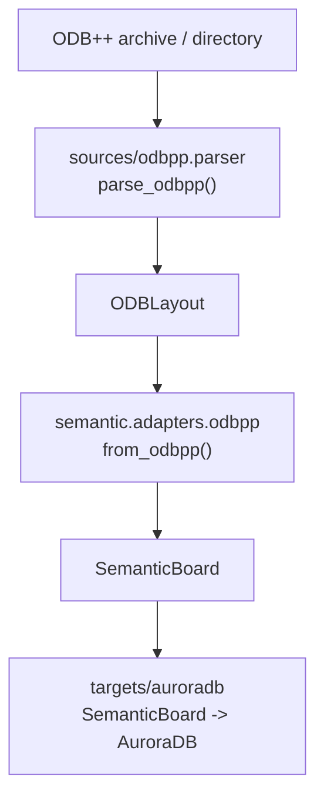

<a id="top"></a>
# ODB++ 到 Semantic 映射 / ODB++ To Semantic Mapping

[中文](#zh) | [English](#en)

<a id="zh"></a>
## 中文

[English](#en) | [返回顶部](#top)

本文档说明 `sources/odbpp` 解析出的 `ODBLayout` 如何被 `semantic.adapters.odbpp` 转换成 `SemanticBoard`。重点是对象映射、字段来源、旋转关系，以及这些语义对象被 AuroraDB target 消费时需要保持的不变量。

## 适用范围

- 适用于 `ODBLayout -> SemanticBoard`。
- 主要实现位置是 `semantic/adapters/odbpp.py`。
- 下游 AuroraDB 输出位于 `targets/auroradb/exporter.py`，本文只说明 ODB++ 进入 Semantic 后应携带哪些语义和旋转 hint。
- 本文不替代 ODB++ 官方规范；字段级歧义以官方 ODB++ Design Format Specification 为准。

## 总体流程



`from_odbpp()` 的处理顺序很重要：

1. 建立 matrix layer 名称、drill span、stackup、material。
2. 建立 net、feature-to-net、pin-to-net、feature-to-pin 索引。
3. 遍历 layer features，先生成 shape、primitive、普通 pad、drill via 和 slotted via。
4. 根据 component / package / pin 信息生成 footprint、component、pin 和 component-owned pad。
5. 用已经生成的 pad 和 negative primitive 反向细化 via template。
6. 生成 connectivity edge 和 diagnostics。

## 对象映射表

| ODB++ 来源 | Semantic 对象 | 主要字段 | 实现位置 |
| --- | --- | --- | --- |
| metadata / selected step | `SemanticMetadata` | `source_format="odbpp"`、source path、step、parser/schema version | `from_odbpp()` |
| step / layer units | `SemanticBoard.units` | 选中 step profile units，缺失时回退 layer units | `_selected_units()` |
| matrix rows | `SemanticLayer` | name、layer type、role、side、order、thickness、material | `_semantic_stackup()` |
| layer attrlist | `SemanticMaterial` | copper / dielectric / soldermask material hint、介电常数、损耗、铜厚 | `_ensure_odbpp_material()` |
| net records | `SemanticNet` | name、role、source；无网络别名统一成 `NoNet` | `_semantic_nets()` |
| feature symbol / package shape | `SemanticShape` | `Circle`、`Rectangle`、`RoundedRectangle`、`Polygon` 等 AuroraDB-compatible geometry | `_shape_id_from_symbol()`、`_shape_id_from_package_shape()` |
| signal-layer `P` feature | `SemanticPad` 或 component pad source info | point pad 的 shape、net、layer、position、orientation、mirror、polarity | `from_odbpp()`、`_semantic_components()` |
| signal-layer `L` / `A` feature | `SemanticPrimitive(kind=trace/arc)` | center line、width、arc center、clockwise flag | `_primitives_from_feature()` |
| signal-layer `S` feature | `SemanticPrimitive(kind=polygon/zone)` | island / hole 分组、polygon points、arc vertices、voids、polarity | `_surface_contour_groups()`、`_apply_surface_group_geometry()` |
| drill-layer `P` feature | `SemanticVia` + `SemanticViaTemplate` | drill point via、layer span、barrel shape、drill tool metadata | `_upsert_via_template()` |
| drill-layer `L` feature | slotted `SemanticVia` + `RoundedRectangle` shape | slot center、width、length、rotation、layer span | `_shape_id_from_drill_slot()`、`_drill_slot_geometry()` |
| packages | `SemanticFootprint` | package name、attributes、body outlines、package pad geometry hints | `_semantic_components()`、`_footprint_geometry_from_package()` |
| components | `SemanticComponent` | refdes、part/package/footprint、layer、side、location、rotation、attributes | `_semantic_components()` |
| component pins | `SemanticPin` | pin name、component id、net id、pin layer、absolute position | `_semantic_components()` |
| pin-associated pad features | component-owned `SemanticPad` | pin id、component id、footprint id、shape、layer、absolute position、rotation | `_pad_infos_for_pin()` |
| package pin fallback | component-owned `SemanticPad` | 当 feature pad 不能绑定到 pin 时，用 package pin / package shape 推导 pad | `_package_pad_infos_for_pin()` |
| matched pad / negative pad near via | refined `SemanticViaTemplate` | per-layer pad shape、antipad shape、relative rotation hints | `_refine_via_templates_from_pads()` |

## Layer 和材料映射

- matrix row 负责层顺序和层角色。
- layer feature 文件的 `attrlist` 只作为 material / thickness hint，不替代 matrix row。
- signal / plane layer 会进入 AuroraDB metal layer 输出。
- dielectric layer 保留在 semantic stackup 中，后续写入 `stackup.dat` / `stackup.json`，不生成 AuroraDB `MetalLayer`。
- drill layer 只用于 via span 和 drill tool 解释，不作为 metal layer 输出。

## Net 和 NoNet 映射

- 普通 ODB++ net record 生成 `SemanticNet(name=<source name>)`。
- `$NONE$`、`$NONE$;;ID=...`、`$NONE`、`NONE$`、`NoNet` 等无网络别名统一映射为 `SemanticNet(name="NoNet", role="no_net")`。
- net `FID` 记录建立 `feature -> net` 关系。
- net `SNT` / pin reference 建立 `component pin -> net` 关系。
- 位于 routable layer 的正极性 no-net trace / arc / polygon primitive 会提升到 `NoNet`，供 AuroraDB 输出可见 no-net geometry。

## Shape 映射

标准 symbol 的主要映射：

| ODB++ symbol | Semantic shape | AuroraDB geometry |
| --- | --- | --- |
| `r...` | circle | `Circle` |
| `s...` | square-as-rectangle | `Rectangle` |
| `rect...x...` | rectangle | `Rectangle` |
| `rect...x...xr...` | rounded rectangle | `RoundedRectangle` |
| `oval...x...` | rounded rectangle | `RoundedRectangle` |
| `di...x...` | diamond polygon | `Polygon` |
| custom symbol `S` contour | polygon | `Polygon` |

Package pin / package body geometry additionally maps:

- `RC` -> `Rectangle`
- `CR` -> `Circle`
- `SQ` -> `Rectangle`
- contour geometry -> `Polygon`

## Component、Pin、Pad 映射

Component 映射规则：

- `SemanticComponent.location` 来自 ODB++ component placement；Mentor Xpedition `REFLOC` 的前两个偏移量会叠加到 placement。
- `SemanticComponent.rotation` 来自 ODB++ component rotation，单位从 degree 转为 radian。
- `SemanticComponent.side` 根据 component layer name 推导。
- 如果一个 component 的所有 resolved pin pad 都在同一个 metal layer，则 `SemanticComponent.layer_name` 使用该 metal layer；否则回退到源 component layer。
- 原始 ODB++ component layer 保留在 `SemanticComponent.attributes["ODBPP_COMPONENT_LAYER"]`。

Pin / Pad 映射规则：

- `SemanticPin` 表示 pin 的电气连接和绝对位置。
- `SemanticPad` 表示 pin pad 铜皮几何、绝对位置、layer、shape 和 rotation。
- 优先使用 net `FID` 关联的真实 feature pad。
- 如果 feature pad 无法绑定 pin，则回退到 package pin / package shape，并按 matrix 最外侧 signal / plane 层解析 top/bottom layer。
- component pad 的 `shape_id`、`rotation`、`mirror_x` 会进入 `SemanticPad.geometry`。
- footprint pad 在 AuroraDB target 阶段由 representative component pad 反推，不在 ODB++ adapter 中提前固化。
- 对 ODB++ 来源，AuroraDB target 使用 component pad 反推 footprint pad 时，不导出 package body outline 到 footprint metal-layer geometry，避免 package-local outline 被当作 pad / component 尺寸渲染。

## Via 和 Via Template 映射

ODB++ via 的基本规则：

- matrix `DRILL` row（包括 Xpedition `d_1_2` 这类命名）的 `P` feature 生成 point via。
- matrix `DRILL` row 的 `L` feature 生成 slotted via。
- 没有 net 绑定的 drill feature 会归入 `NoNet`。
- drill layer 的 start/end metal layer 由 matrix row 的 start/end name 决定。
- `SemanticVia.template_id` 指向 `SemanticViaTemplate`。
- `SemanticVia.position` 是 via center。
- slotted via 的 barrel shape 使用 `RoundedRectangle`，宽度来自 drill symbol，长度来自 centerline length + width。

Via template 初始状态：

- 初始 template 的每层 pad shape 等于 barrel shape。
- 这只是保底形态，不代表真实 copper pad。

Via template refinement：

- 在 component pad 和普通 pad 都生成后，`_refine_via_templates_from_pads()` 查找同 net、同 layer、同坐标附近的 positive pad。
- 找到 positive pad 时，用该 pad 的 shape 替换对应 layer pad shape。
- 找到 negative pad 或 no-net negative primitive 时，用其 shape 填充 antipad。
- 匹配容差当前为 `0.001` source unit。
- 候选排序先按距离，再在同距离时优先 component-owned pad。
- 相对旋转写入 `SemanticViaTemplate.geometry["layer_pad_rotations"]`。

## 旋转模型

### 基本约定

ODB++ Design Format Specification 定义 rotation 为 clockwise-positive。本项目当前 ODB++ adapter 采用 source-preserving 策略：

- ODB++ degree 在进入 Semantic 前转换为 radian。
- 角度符号不在 Semantic 中改成数学 CCW。
- 因此 ODB++ 来源的 `SemanticComponent.rotation`、`SemanticPad.geometry.rotation`、slotted `SemanticVia.geometry.rotation` 都是 clockwise-positive。

这点和 AEDB 不同。AEDB 进入 target exporter 后仍走 AEDB 的既有符号转换；ODB++ 不应套用 AEDB 的 sign inversion。

### ODB++ orient_def 到 SemanticPad

`P` feature 的 `orient_def` 当前按以下规则解析：

| orient_def | Semantic rotation | mirror |
| --- | --- | --- |
| `0` | `0 deg` | none |
| `1` | `90 deg` | none |
| `2` | `180 deg` | none |
| `3` | `270 deg` | none |
| `4` | `0 deg` | `mirror_x=true` |
| `5` | `90 deg` | `mirror_x=true` |
| `6` | `180 deg` | `mirror_x=true` |
| `7` | `270 deg` | `mirror_x=true` |
| `8 <angle>` | `<angle>` | none |
| `9 <angle>` | `<angle>` | `mirror_x=true` |

实现位置：`_feature_orientation()`。

标准有方向 symbol（当前包括 `rect...x...`、`rect...x...xr...`、`oval...x...`）进入 Semantic 时会先使用统一 shape 基准：

```text
semantic_shape_width_height = canonicalize_long_axis_to_X(odb_symbol_width, odb_symbol_height)
symbol_axis_delta = 90 deg if odb_symbol_height > odb_symbol_width else 0 deg
semantic_pad_rotation = normalize_180(odb_orient_rotation - symbol_axis_delta)
```

也就是说，如果 ODB++ symbol 自身把长轴定义在 `+Y`，Semantic 会把 shape 宽高交换成横向长轴，并把这个 `90 deg` 基准差折算到 pad rotation 中。该规则只依据 symbol 尺寸，不依据 layer、refdes 或坐标。

### Component placement 旋转

设 ODB++ component local point 为 `(x_l, y_l)`，component board origin 为 `(x_0, y_0)`，clockwise-positive rotation 为 `theta`。

当前项目使用的 ODB++ local -> board 关系是：

```text
x_board = x_0 + x_l * cos(theta) + y_l * sin(theta)
y_board = y_0 - x_l * sin(theta) + y_l * cos(theta)
```

从 placed pad 反推 footprint-local pad 坐标时使用 inverse：

```text
dx = x_board - x_0
dy = y_board - y_0

x_l = dx * cos(theta) - dy * sin(theta)
y_l = dx * sin(theta) + dy * cos(theta)
```

实现位置：`targets/auroradb/parts.py::_relative_pad_location()`。

### Footprint pad 局部旋转

设 source pad absolute rotation 为 `theta_pad`，component rotation 为 `theta_comp`。

ODB++ representative placed pad 反推 footprint pad 时使用：

```text
theta_footprint_pad = normalize(theta_pad - theta_comp)
```

实现位置：`targets/auroradb/parts.py::_format_footprint_pad_rotation()`。

这个公式说明：component rotation 和 pad orientation 不能互相替代；pad 的局部角度必须从二者差值获得。

### Slotted via 旋转

drill-layer `L` feature 用 start/end centerline 表示 slot。当前 slot rotation 计算为：

```text
dx = end.x - start.x
dy = end.y - start.y
theta_slot = atan2(-dy, dx)
```

这表示 slot 长轴相对 shape `+X` 方向的 clockwise-positive 角度，使 `RoundedRectangle(total_length,width)` 的长轴对齐 drill centerline。该基准与普通 `Rectangle` / `RoundedRectangle` pad、AuroraDB `Location` 和 `ViaList` layer row 的旋转基准一致。

注意：slot barrel 本身对 `180 deg` 旋转对称，但 `theta_slot` 仍保留 start -> end 方向。因此如果 ODB++ source 将同形 slot 的 start/end 反向，barrel 视觉不变，但 `theta_slot` 会相差 `180 deg`。对于半周对称 pad，这个差异会在相对角计算中归一；对于非对称 pad，仍保留完整差异。排查 slot via pad 旋转时必须同时看：

- source slot centerline start/end。
- `SemanticVia.geometry.rotation`。
- matched pad 的 absolute rotation。
- `SemanticViaTemplate.geometry.layer_pad_rotations`。

### Via template layer pad 相对旋转

设 matched layer pad absolute rotation 为 `theta_pad`，via instance rotation 为 `theta_via`。

Semantic 保存同一 shape 基准上的 source rotation 相对角。标准有方向 symbol 的宽高轴向已经在 `SemanticPad.geometry.rotation` 中规范化，因此这里不再做 via 专用的 shape-axis 扣除：

```text
theta_layer_pad_relative = normalize(theta_pad - theta_via)
```

原因是 AuroraDB 会先按 shape 的 `width` / `height` 定义绘制 `Rectangle` / `RoundedRectangle`，再应用 `ViaList` layer row rotation，最后叠加 `NetVias.Via` instance rotation。shape 自身的默认轴向是几何定义的一部分，不能在 Semantic 相对角中提前扣除。

对于几何上存在 `180 deg` 半周对称的 matched pad / antipad，`normalize()` 使用半周等价归一：

```text
theta_layer_pad_relative = normalize_180(theta_pad - theta_via)
```

当前半周对称判断只看 shape 几何：中心在原点的 `Circle` / `Rectangle` / `RoundedRectangle` 直接成立；`Polygon` 只有在每个顶点都能找到关于原点的反向顶点时才成立。这个规则用于消除 slot `L` start/end 方向或 symbol 宽高基准造成的 `180 deg` 数值差，但不对非对称 polygon 做简化。

实现位置：

- `_candidate_pad_match()`
- `_relative_rotation()`
- `_shape_is_half_turn_symmetric()`
- `_layer_pad_rotations_from_matches()`

这个值保存在：

```text
SemanticViaTemplate.geometry["layer_pad_rotations"][layer_name]["pad"]
SemanticViaTemplate.geometry["layer_pad_rotations"][layer_name]["antipad"]
```

AuroraDB `ViaList` layer row 自带 `CCW` 字段；当前 exporter 写 `CCW=Y`，因此会在 target 边界把 ODB++ clockwise 相对角转换为 counter-clockwise 数值。该转换只发生在 `Semantic -> AuroraDB` 输出层，不能反向污染 ODB++ -> Semantic 的相对旋转定义。

### 当前必须保持的旋转不变量

对 ODB++ -> Semantic，以下不变量应成立：
```text
semantic_component_rotation_rad = radians(odb_component_rotation_deg)
semantic_pad_shape              = canonicalize_long_axis_to_X(odb_symbol_shape)
semantic_pad_rotation_rad       = normalize_180(radians(odb_orient_def_angle_deg) - symbol_axis_delta)
semantic_slot_rotation_rad      = atan2(-slot_dy, slot_dx)
semantic_layer_pad_relative_rad = normalize_180(semantic_pad_rotation_rad - semantic_via_rotation_rad)
                                  when matched shape is half-turn symmetric,
                                  otherwise normalize_360(...)
```

对 target 输出，应检查最终可视角：

```text
effective_pad_angle = via_instance_angle + via_template_layer_pad_relative_angle
```

AuroraDB `ViaList` layer row 使用 `CCW=Y` 时，应在 target writer 中转换：

```text
target_angle_ccw = -source_clockwise_angle
```

该转换只能发生在 target 边界，不能改变 Semantic 中保存的 ODB++ source-preserving angle。

## 排查 via pad 旋转的步骤

1. 在 ODB++ source JSON 中找到 drill feature，确认它是 drill `P` 还是 drill `L`。
2. 对 drill `L`，记录 start、end、`theta_slot = atan2(-dy, dx)`。
3. 找到同 net、同 layer、同坐标的 positive pad feature 或 component-owned pad。
4. 记录 matched pad 的 `orient_def` 和 `theta_pad`。
5. 检查 Semantic：
   - `SemanticVia.geometry.rotation`
   - `SemanticViaTemplate.geometry.layer_pad_rotations`
   - `SemanticViaTemplate.layer_pads[].pad_shape_id`
6. 检查 AuroraDB：
   - `NetVias.Via` 的 template id、location rotation。
   - `ViaList.Via.<layer>` 的 pad shape、pad rotation、pad CCW flag。
7. 用 target 约定计算 effective pad angle，确认是否等于 ODB++ pad absolute orientation。

## 已知风险

- ODB++ slotted drill `L` 的 start/end 方向可能导致 `180 deg` 等价 barrel 被保存为不同 `theta_slot`。当前转换会对半周对称 pad / antipad 的相对角做 `180 deg` 等价归一；非对称 polygon 仍保留完整 `360 deg` 相对角，避免错误合并。
- `Location` 与 `ViaList` layer row 都带有 `CCW` 字段；当前只对 `ViaList` layer row 的 per-layer pad/antipad rotation 做 ODB++ clockwise -> AuroraDB `CCW=Y` 转换。若后续确认 `Location` 字段也需要不同方向语义，应在 `targets/auroradb/geometry.py` / `parts.py` 中分开处理，不能在 ODB++ adapter 中硬改 source angle。
- component bottom-side mirror 同时影响 footprint-local pad 坐标和最终 placement flip。相关逻辑必须通过 component pad 坐标不变量验证。

<a id="en"></a>
## English

[中文](#zh) | [Back to top](#top)

This document describes how `ODBLayout` from `sources/odbpp` is converted into `SemanticBoard` by `semantic.adapters.odbpp`. It focuses on object mapping, field origins, rotation relationships, and invariants required by downstream AuroraDB target export.

## Scope

- Applies to `ODBLayout -> SemanticBoard`.
- Main implementation: `semantic/adapters/odbpp.py`.
- Downstream AuroraDB output lives in `targets/auroradb/exporter.py`; this document only states what ODB++ semantics and rotation hints must be carried into Semantic.
- This document is not a replacement for the official ODB++ specification; use the official ODB++ Design Format Specification for field-level ambiguity.

## High-Level Flow


`from_odbpp()` runs in this order:

1. Build matrix layer names, drill spans, stackup, and materials.
2. Build net, feature-to-net, pin-to-net, and feature-to-pin indexes.
3. Walk layer features and create shapes, primitives, free pads, drill vias, and slotted vias.
4. Build footprints, components, pins, and component-owned pads from component / package / pin data.
5. Refine via templates from generated pads and negative primitives.
6. Build connectivity edges and diagnostics.

## Object Mapping Table

| ODB++ source | Semantic object | Main fields | Implementation |
| --- | --- | --- | --- |
| metadata / selected step | `SemanticMetadata` | `source_format="odbpp"`, source path, step, parser/schema version | `from_odbpp()` |
| step / layer units | `SemanticBoard.units` | selected step profile units, with layer-unit fallback | `_selected_units()` |
| matrix rows | `SemanticLayer` | name, layer type, role, side, order, thickness, material | `_semantic_stackup()` |
| layer attrlist | `SemanticMaterial` | copper / dielectric / soldermask hints, Dk, loss, copper thickness | `_ensure_odbpp_material()` |
| net records | `SemanticNet` | name, role, source; no-net aliases become `NoNet` | `_semantic_nets()` |
| feature symbol / package shape | `SemanticShape` | AuroraDB-compatible `Circle`, `Rectangle`, `RoundedRectangle`, `Polygon` geometry | `_shape_id_from_symbol()`, `_shape_id_from_package_shape()` |
| signal-layer `P` feature | `SemanticPad` or component pad source info | pad shape, net, layer, position, orientation, mirror, polarity | `from_odbpp()`, `_semantic_components()` |
| signal-layer `L` / `A` feature | `SemanticPrimitive(kind=trace/arc)` | center line, width, arc center, clockwise flag | `_primitives_from_feature()` |
| signal-layer `S` feature | `SemanticPrimitive(kind=polygon/zone)` | island / hole grouping, polygon points, arc vertices, voids, polarity | `_surface_contour_groups()`, `_apply_surface_group_geometry()` |
| drill-layer `P` feature | `SemanticVia` + `SemanticViaTemplate` | point via, layer span, barrel shape, drill-tool metadata | `_upsert_via_template()` |
| drill-layer `L` feature | slotted `SemanticVia` + `RoundedRectangle` shape | slot center, width, length, rotation, layer span | `_shape_id_from_drill_slot()`, `_drill_slot_geometry()` |
| packages | `SemanticFootprint` | package name, attributes, body outlines, package pad geometry hints | `_semantic_components()`, `_footprint_geometry_from_package()` |
| components | `SemanticComponent` | refdes, part/package/footprint, layer, side, location, rotation, attributes | `_semantic_components()` |
| component pins | `SemanticPin` | pin name, component id, net id, pin layer, absolute position | `_semantic_components()` |
| pin-associated pad features | component-owned `SemanticPad` | pin id, component id, footprint id, shape, layer, absolute position, rotation | `_pad_infos_for_pin()` |
| package pin fallback | component-owned `SemanticPad` | inferred pad when feature pads cannot be bound to pins | `_package_pad_infos_for_pin()` |
| matched pad / negative pad near via | refined `SemanticViaTemplate` | per-layer pad shape, antipad shape, relative rotation hints | `_refine_via_templates_from_pads()` |

## Layer And Material Mapping

- Matrix rows own layer order and roles.
- Layer feature `attrlist` files provide material and thickness hints; they do not replace matrix rows.
- Signal / plane layers enter AuroraDB metal-layer output.
- Dielectric layers stay in semantic stackup and are later written to `stackup.dat` / `stackup.json`, not to AuroraDB `MetalLayer`.
- Drill layers are used for via spans and drill-tool interpretation, not as metal layers.

## Net And NoNet Mapping

- A normal ODB++ net record becomes `SemanticNet(name=<source name>)`.
- `$NONE$`, `$NONE$;;ID=...`, `$NONE`, `NONE$`, and source `NoNet` aliases become `SemanticNet(name="NoNet", role="no_net")`.
- Net `FID` records build `feature -> net` links.
- Net `SNT` / pin references build `component pin -> net` links.
- Positive no-net trace / arc / polygon primitives on routable layers are promoted to `NoNet` so they remain visible in AuroraDB output.

## Shape Mapping

Main standard-symbol mapping:

| ODB++ symbol | Semantic shape | AuroraDB geometry |
| --- | --- | --- |
| `r...` | circle | `Circle` |
| `s...` | square-as-rectangle | `Rectangle` |
| `rect...x...` | rectangle | `Rectangle` |
| `rect...x...xr...` | rounded rectangle | `RoundedRectangle` |
| `oval...x...` | rounded rectangle | `RoundedRectangle` |
| `di...x...` | diamond polygon | `Polygon` |
| custom symbol `S` contour | polygon | `Polygon` |

Package geometry additionally maps:

- `RC` -> `Rectangle`
- `CR` -> `Circle`
- `SQ` -> `Rectangle`
- contour geometry -> `Polygon`

## Component, Pin, And Pad Mapping

Component rules:

- `SemanticComponent.location` comes from ODB++ component placement; the first two Mentor Xpedition `REFLOC` offsets are applied to the placement.
- `SemanticComponent.rotation` comes from ODB++ component rotation, converted from degrees to radians.
- `SemanticComponent.side` is derived from the component layer name.
- If all resolved pin pads for a component share one metal layer, `SemanticComponent.layer_name` uses that metal layer; otherwise it falls back to the source component layer.
- The original ODB++ component layer is preserved in `SemanticComponent.attributes["ODBPP_COMPONENT_LAYER"]`.

Pin / pad rules:

- `SemanticPin` represents pin connectivity and absolute pin position.
- `SemanticPad` represents pin-pad copper geometry, absolute position, layer, shape, and rotation.
- Real feature pads associated by net `FID` are preferred.
- If feature pads cannot be bound to a pin, package pin / package shape data is used as fallback, with top/bottom layers resolved from the outermost signal / plane rows in the matrix.
- Component pad `shape_id`, `rotation`, and `mirror_x` are stored in `SemanticPad.geometry`.
- Footprint pads are inferred later by the AuroraDB target from representative component pads; they are not frozen in the ODB++ adapter.
- For ODB++ sources, when the AuroraDB target infers footprint pads from component pads, package body outlines are not exported as footprint metal-layer geometry so package-local outlines are not rendered as pad or component size.

## Via And Via Template Mapping

Base via rules:

- `P` features on matrix `DRILL` rows, including Xpedition names such as `d_1_2`, create point vias.
- `L` features on matrix `DRILL` rows create slotted vias.
- Drill features without a net binding join `NoNet`.
- Drill start/end metal layers come from matrix row start/end names.
- `SemanticVia.template_id` points to `SemanticViaTemplate`.
- `SemanticVia.position` is the via center.
- Slotted via barrel shape is a `RoundedRectangle(total_length,width,radius)`; width comes from the drill symbol and total length is centerline length plus width.

Initial via templates:

- Each layer pad initially uses the barrel shape.
- This is only a fallback, not the real copper pad whenever same-location pads are available.

Via template refinement:

- After component pads and free pads are generated, `_refine_via_templates_from_pads()` looks for same-net, same-layer, same-location positive pads.
- Positive matches replace the layer pad shape.
- Negative pad matches or no-net negative primitives fill antipad shapes.
- Current match tolerance is `0.001` source unit.
- Candidate ordering is distance-first, with component-owned pads preferred only at the same distance.
- Relative rotations are stored in `SemanticViaTemplate.geometry["layer_pad_rotations"]`.

## Rotation Model

### Basic Convention

The ODB++ Design Format Specification defines rotations as clockwise-positive. The current ODB++ adapter uses a source-preserving strategy:

- ODB++ degrees are converted to radians before entering Semantic.
- The angle sign is not converted to mathematical CCW in Semantic.
- Therefore ODB++-derived `SemanticComponent.rotation`, `SemanticPad.geometry.rotation`, and slotted `SemanticVia.geometry.rotation` are clockwise-positive.

This differs from AEDB. AEDB still uses its existing target-export sign conversion; ODB++ must not reuse AEDB's sign inversion.

### ODB++ orient_def To SemanticPad

`P` feature `orient_def` is parsed as:

| orient_def | Semantic rotation | mirror |
| --- | --- | --- |
| `0` | `0 deg` | none |
| `1` | `90 deg` | none |
| `2` | `180 deg` | none |
| `3` | `270 deg` | none |
| `4` | `0 deg` | `mirror_x=true` |
| `5` | `90 deg` | `mirror_x=true` |
| `6` | `180 deg` | `mirror_x=true` |
| `7` | `270 deg` | `mirror_x=true` |
| `8 <angle>` | `<angle>` | none |
| `9 <angle>` | `<angle>` | `mirror_x=true` |

Implementation: `_feature_orientation()`.

Standard oriented symbols, currently `rect...x...`, `rect...x...xr...`, and `oval...x...`, enter Semantic on a unified shape basis:

```text
semantic_shape_width_height = canonicalize_long_axis_to_X(odb_symbol_width, odb_symbol_height)
symbol_axis_delta = 90 deg if odb_symbol_height > odb_symbol_width else 0 deg
semantic_pad_rotation = normalize_180(odb_orient_rotation - symbol_axis_delta)
```

In other words, if the ODB++ symbol itself defines the long axis on `+Y`, Semantic swaps the shape width/height to a horizontal long-axis definition and folds that `90 deg` basis difference into the pad rotation. The rule depends only on symbol dimensions, not on layer, refdes, or coordinates.

### Component Placement Rotation

Let an ODB++ component-local point be `(x_l, y_l)`, component board origin be `(x_0, y_0)`, and clockwise-positive rotation be `theta`.

The project uses this ODB++ local -> board transform:

```text
x_board = x_0 + x_l * cos(theta) + y_l * sin(theta)
y_board = y_0 - x_l * sin(theta) + y_l * cos(theta)
```

When deriving footprint-local pad coordinates from placed pads, the inverse is:

```text
dx = x_board - x_0
dy = y_board - y_0

x_l = dx * cos(theta) - dy * sin(theta)
y_l = dx * sin(theta) + dy * cos(theta)
```

Implementation: `targets/auroradb/parts.py::_relative_pad_location()`.

### Footprint Pad Local Rotation

Let source pad absolute rotation be `theta_pad`, and component rotation be `theta_comp`.

When deriving footprint pads from ODB++ representative placed pads:

```text
theta_footprint_pad = normalize(theta_pad - theta_comp)
```

Implementation: `targets/auroradb/parts.py::_format_footprint_pad_rotation()`.

This means component rotation and pad orientation are separate concepts; local pad angle must come from their difference.

### Slotted Via Rotation

Drill-layer `L` features encode slot centerlines with start/end points. Current slot rotation is:

```text
dx = end.x - start.x
dy = end.y - start.y
theta_slot = atan2(-dy, dx)
```

This is the clockwise-positive angle of the slot long axis relative to the shape `+X` axis, aligning `RoundedRectangle(total_length,width)` to the drill centerline. This basis matches regular `Rectangle` / `RoundedRectangle` pads, AuroraDB `Location`, and `ViaList` layer-row rotations.

Important: a slot barrel is symmetric under `180 deg` rotation, but `theta_slot` still preserves source start -> end direction. If ODB++ reverses start/end for visually identical slots, the barrel still looks correct while `theta_slot` differs by `180 deg`. For half-turn-symmetric pads this difference is normalized during relative-angle calculation; for asymmetric pads the full difference is preserved. Slot via pad rotation debugging must inspect:

- source slot centerline start/end,
- `SemanticVia.geometry.rotation`,
- matched pad absolute rotation,
- `SemanticViaTemplate.geometry.layer_pad_rotations`.

### Via Template Layer Pad Relative Rotation

Let matched layer pad absolute rotation be `theta_pad`, and via instance rotation be `theta_via`.

Semantic stores the source-rotation relative angle on a shared shape basis. Standard oriented symbol width/height axes have already been normalized into `SemanticPad.geometry.rotation`, so this step does not apply any via-specific shape-axis subtraction:

```text
theta_layer_pad_relative = normalize(theta_pad - theta_via)
```

AuroraDB first draws `Rectangle` / `RoundedRectangle` using the shape's own `width` / `height`, then applies the `ViaList` layer-row rotation, then applies the `NetVias.Via` instance rotation. The shape default axis is part of the geometry definition and must not be removed inside the Semantic relative angle.

For matched pad / antipad shapes that are geometrically symmetric under a `180 deg` rotation, `normalize()` uses half-turn-equivalent normalization:

```text
theta_layer_pad_relative = normalize_180(theta_pad - theta_via)
```

The half-turn-symmetry decision is based only on shape geometry: centered `Circle` / `Rectangle` / `RoundedRectangle` shapes qualify directly; a `Polygon` qualifies only when every vertex has an opposite vertex about the origin. This removes `180 deg` numeric differences caused by slot `L` start/end direction or symbol width/height basis while preserving asymmetric polygons.

Implementation:

- `_candidate_pad_match()`
- `_relative_rotation()`
- `_shape_is_half_turn_symmetric()`
- `_layer_pad_rotations_from_matches()`

The value is stored at:

```text
SemanticViaTemplate.geometry["layer_pad_rotations"][layer_name]["pad"]
SemanticViaTemplate.geometry["layer_pad_rotations"][layer_name]["antipad"]
```

AuroraDB `ViaList` layer rows carry their own `CCW` flag. The exporter writes `CCW=Y`, so it converts ODB++ clockwise relative angles to counter-clockwise numeric values at the target boundary. This conversion belongs only in `Semantic -> AuroraDB`; it must not change the ODB++ -> Semantic relative-angle definition.

### Rotation Invariants

For ODB++ -> Semantic:
```text
semantic_component_rotation_rad = radians(odb_component_rotation_deg)
semantic_pad_shape              = canonicalize_long_axis_to_X(odb_symbol_shape)
semantic_pad_rotation_rad       = normalize_180(radians(odb_orient_def_angle_deg) - symbol_axis_delta)
semantic_slot_rotation_rad      = atan2(-slot_dy, slot_dx)
semantic_layer_pad_relative_rad = normalize_180(semantic_pad_rotation_rad - semantic_via_rotation_rad)
                                  when matched shape is half-turn symmetric,
                                  otherwise normalize_360(...)
```

For target output, verify the visible angle with the target convention:

```text
effective_pad_angle = via_instance_angle + via_template_layer_pad_relative_angle
```

When AuroraDB `ViaList` layer rows use `CCW=Y`:

```text
target_angle_ccw = -source_clockwise_angle
```

That conversion must happen only at the target boundary, not inside Semantic.

## Via Pad Rotation Debug Checklist

1. Find the drill feature in ODB++ source JSON and classify it as drill `P` or drill `L`.
2. For drill `L`, record start, end, and `theta_slot = atan2(-dy, dx)`.
3. Find the same-net, same-layer, same-location positive pad feature or component-owned pad.
4. Record the matched pad `orient_def` and `theta_pad`.
5. Check Semantic:
   - `SemanticVia.geometry.rotation`
   - `SemanticViaTemplate.geometry.layer_pad_rotations`
   - `SemanticViaTemplate.layer_pads[].pad_shape_id`
6. Check AuroraDB:
   - `NetVias.Via` template id and location rotation.
   - `ViaList.Via.<layer>` pad shape, pad rotation, and pad CCW flag.
7. Compute the effective pad angle under the target convention and confirm it equals the ODB++ pad absolute orientation.

## Known Risks

- ODB++ slotted drill `L` start/end direction can store visually equivalent barrels with `180 deg` different `theta_slot`. The current conversion normalizes relative angles under `180 deg` equivalence for half-turn-symmetric pad / antipad shapes; asymmetric polygons still keep full `360 deg` relative angles to avoid false merging.
- `Location` and `ViaList` layer rows both contain `CCW` fields. The current exporter applies ODB++ clockwise -> AuroraDB `CCW=Y` conversion only to `ViaList` per-layer pad/antipad rotations. If `Location` fields are later proven to need a different direction convention, handle that separately in `targets/auroradb/geometry.py` / `parts.py` rather than changing ODB++ source angles in the adapter.
- Component bottom-side mirror affects both footprint-local pad coordinates and final placement flip. It must be verified with component pad coordinate invariants.
