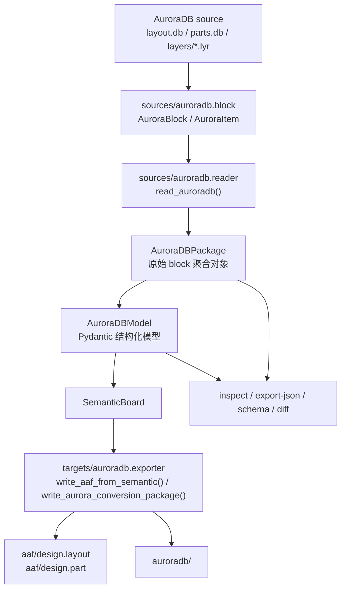
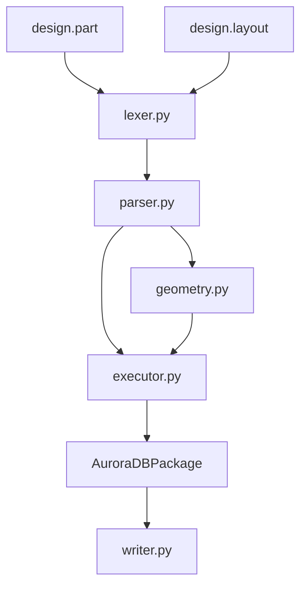
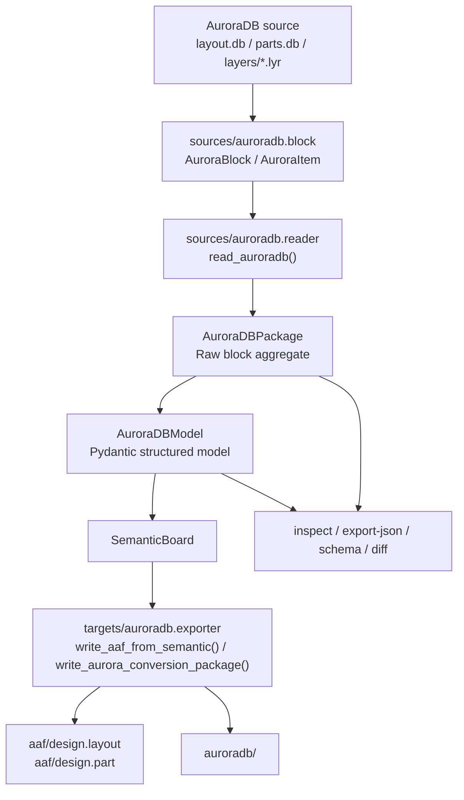

<a id="top"></a>
# AuroraDB 解析架构 / AuroraDB Parsing Architecture

[中文](#zh) | [English](#en)

<a id="zh"></a>
## 中文

[English](#en) | [返回顶部](#top)

本文档说明 `sources/auroradb` 源解析、`SemanticBoard` 适配以及 `targets/auroradb` 目标导出之间的关系。当前架构的核心原则是：**AuroraDB 在项目中同时承担 source 与 target 两种职责，但两者都必须通过 `SemanticBoard` 衔接；source 侧以 `AuroraDBPackage / AuroraDBModel` 为中心，target 侧以 `SemanticBoard -> AAF -> AuroraDB` 为中心。**

## 总览



## 分层设计

### 1. 原始 block 层

位置：[auroradb/block.py](../block.py)

这一层负责忠实读写 ASIV `CeIODataBlock` 风格文本：

- `AuroraBlock` 表示 `{ ... }` block。
- `AuroraItem` 表示 block 中的一行 item。
- `read_block_file()` 读取 `layout.db`、`parts.db`、`*.lyr`。
- `write_block_file()` 写回 AuroraDB block 文件。

这一层不试图解释业务含义，目标是尽量保留 AuroraDB 原始文件结构，适合写回、严格 block-tree diff 和问题定位。

### 2. Package 聚合层

位置：[auroradb/reader.py](../reader.py)、[auroradb/models.py](../models.py)

`read_auroradb()` 读取一个 AuroraDB 目录并生成 `AuroraDBPackage`：

```python
AuroraDBPackage(
    root=...,
    layout=...,      # layout.db 的 CeLayout block
    parts=...,       # parts.db 的 CeParts block
    layers={...},    # layers/*.lyr 的 MetalLayer blocks
    diagnostics=[...],
)
```

`AuroraDBPackage` 是 AuroraDB source 侧的内存核心对象。当前所有源读取和源检查能力都围绕它展开：

- AuroraDB 文件读取会生成 `AuroraDBPackage`。
- summary、diff、JSON 导出、schema 都从 `AuroraDBPackage` 出发。

AuroraDB target 侧则不直接以 `AuroraDBPackage` 为入口，而是先接收 `SemanticBoard`，再由 `targets/auroradb` 生成 AAF 和 AuroraDB 输出目录。

### 3. 结构化模型层

位置：[auroradb/models.py](../models.py)

`AuroraDBPackage.to_model()` 会把原始 block tree 转成与 `aedb/models.py` 风格一致的 Pydantic 结构：

```python
model = read_auroradb(path).to_model()
```

顶层模型是 `AuroraDBModel`：

```text
AuroraDBModel
  metadata
  root
  summary
  layout
    units
    outline
    layer_stackup
    shapes
    via_templates
    nets
      pins
      vias
  layers
    components
    logic_layers
    net_geometries
  parts
    parts
      info
      pins
    schematic_symbols
    footprints
      pad_templates
      metal_layers
      part_pads
  diagnostics
  raw_blocks
```

这一层的目标是让调用方直观看到 AuroraDB source 里直接存储了什么，而不是只面对 `CeIODataBlock` 树。它适合：

- JSON 导出。
- JSON schema。
- UI 展示。
- 调试和审阅 AuroraDB 内容。
- 映射到 `SemanticBoard`，再参与 `AuroraDB -> SemanticBoard -> 其他目标` 流程。

默认结构化 JSON 不展开完整原始 block tree；需要时可使用 `--include-raw-blocks`。

## AuroraDB 文件映射

| 文件 | 原始 block | 结构化模型 |
| --- | --- | --- |
| `layout.db` | `CeLayout` | `AuroraLayoutModel` |
| `parts.db` | `CeParts` | `AuroraPartsModel` |
| `layers/*.lyr` | `MetalLayer` | `list[AuroraMetalLayerModel]` |

`layout.db` 主要映射为：

- `units`
- `outline`
- `layer_stackup`
- `shapes`
- `via_templates`
- `nets`

`layers/*.lyr` 主要映射为：

- `components`
- `logic_layers`
- `net_geometries`

`parts.db` 主要映射为：

- `parts`
- `schematic_symbols`
- `footprints`
- `pad_templates`
- `part_pads`

## AAF 子模块

位置：[targets/auroradb/aaf](../../targets/auroradb/aaf)

在当前语义主导架构下，AAF 不是项目级主格式，而是 `targets/auroradb` 的内部中间层：



职责划分：

- `lexer.py`：ASIV 命令 tokenizer。
- `parser.py`：把 `design.layout` / `design.part` 解析成 `AAFCommand`。
- `geometry.py`：解析 `-g <{...}>` 几何表达式。
- `executor.py`：执行 AAF 命令，生成 AuroraDB block tree。
- `translator.py`：`from-aaf` 高层入口，以及 `SemanticBoard -> AAF -> AuroraDB` 的编译支撑。

这个设计保证两条链都能成立：

- `AuroraDB source -> AuroraDBPackage -> AuroraDBModel -> SemanticBoard`
- `SemanticBoard -> AAF -> AuroraDB target`

## JSON 与 Schema

位置：[auroradb/schema.py](../schema.py)、[auroradb/docs/auroradb_schema.json](auroradb_schema.json)

当前 AuroraDB JSON schema 由 Pydantic 模型生成：

```python
from aurora_translator.sources.auroradb.schema import auroradb_json_schema

schema = auroradb_json_schema()
```

CLI：

```powershell
aurora-translator auroradb schema -o auroradb\docs\auroradb_schema.json
```

导出 JSON：

```powershell
aurora-translator auroradb export-json <auroradb_dir> -o out.json
aurora-translator auroradb export-json <auroradb_dir> -o out-with-raw.json --include-raw-blocks
```

默认 JSON 面向结构化阅读和下游消费。`--include-raw-blocks` 会额外输出：

```text
raw_blocks
  layout
  parts
  layers
```

## 版本边界

位置：[auroradb/version.py](../version.py)

AuroraDB 有独立的格式级版本：

- `AURORADB_PARSER_VERSION`：AuroraDB 读取、AAF 命令执行、AuroraDB 派生逻辑变化时更新。
- `AURORADB_JSON_SCHEMA_VERSION`：AuroraDB JSON 字段、结构或含义变化时更新。

这些版本会写入 JSON：

```json
{
  "metadata": {
    "project_version": "...",
    "parser_version": "...",
    "output_schema_version": "..."
  }
}
```

## 读写与对比策略

当前架构同时保留两类视图：

- 原始 block tree：用于忠实写回、严格结构对比、定位 ASIV 文件差异。
- 结构化 Pydantic 模型：用于理解数据、JSON 导出、schema、UI 和跨格式映射。

默认 `auroradb diff` 比较语义摘要，适合判断关键内容是否一致。`--include-blocks` 会比较完整 block tree，适合排查格式、顺序、数值文本化等更细差异。

<a id="en"></a>
## English

[中文](#zh) | [Back to top](#top)

This document explains how `sources/auroradb` source parsing, `SemanticBoard` adaptation, and `targets/auroradb` export fit together. The core principle is: **AuroraDB plays both source and target roles in the project, but both roles are mediated by `SemanticBoard`; the source side is centered on `AuroraDBPackage / AuroraDBModel`, while the target side is centered on `SemanticBoard -> AAF -> AuroraDB`.**

## Overview



## Layered Design

### 1. Raw Block Layer

Location: [auroradb/block.py](../block.py)

This layer faithfully reads and writes ASIV `CeIODataBlock` style text:

- `AuroraBlock` represents a `{ ... }` block.
- `AuroraItem` represents one item line inside a block.
- `read_block_file()` reads `layout.db`, `parts.db`, and `*.lyr`.
- `write_block_file()` writes AuroraDB block files.

This layer does not interpret business meaning. Its goal is to preserve the original AuroraDB file structure as much as possible, which is useful for writing back, strict block-tree diffing, and issue diagnosis.

### 2. Package Aggregation Layer

Location: [auroradb/reader.py](../reader.py), [auroradb/models.py](../models.py)

`read_auroradb()` reads an AuroraDB directory and builds an `AuroraDBPackage`:

```python
AuroraDBPackage(
    root=...,
    layout=...,      # CeLayout block from layout.db
    parts=...,       # CeParts block from parts.db
    layers={...},    # MetalLayer blocks from layers/*.lyr
    diagnostics=[...],
)
```

`AuroraDBPackage` is the central in-memory object on the AuroraDB source side. All current source-reading and source-inspection capabilities revolve around it:

- Reading AuroraDB files produces an `AuroraDBPackage`.
- Summary, diff, JSON export, and schema generation start from `AuroraDBPackage`.

On the AuroraDB target side, the entry point is not `AuroraDBPackage`. Instead, `targets/auroradb` receives a `SemanticBoard` and generates AAF plus AuroraDB output directories from it.

### 3. Structured Model Layer

Location: [auroradb/models.py](../models.py)

`AuroraDBPackage.to_model()` converts the raw block tree into a Pydantic structure aligned with the style used by `aedb/models.py`:

```python
model = read_auroradb(path).to_model()
```

The top-level model is `AuroraDBModel`:

```text
AuroraDBModel
  metadata
  root
  summary
  layout
    units
    outline
    layer_stackup
    shapes
    via_templates
    nets
      pins
      vias
  layers
    components
    logic_layers
    net_geometries
  parts
    parts
      info
      pins
    schematic_symbols
    footprints
      pad_templates
      metal_layers
      part_pads
  diagnostics
  raw_blocks
```

This layer makes directly stored AuroraDB source data easier to inspect than a raw `CeIODataBlock` tree. It is intended for:

- JSON export.
- JSON schema.
- UI display.
- Debugging and review.
- Mapping into `SemanticBoard`, then participating in `AuroraDB -> SemanticBoard -> other targets`.

Structured JSON does not include the full raw block tree by default. Use `--include-raw-blocks` when it is needed.

## AuroraDB File Mapping

| File | Raw Block | Structured Model |
| --- | --- | --- |
| `layout.db` | `CeLayout` | `AuroraLayoutModel` |
| `parts.db` | `CeParts` | `AuroraPartsModel` |
| `layers/*.lyr` | `MetalLayer` | `list[AuroraMetalLayerModel]` |

`layout.db` mainly maps to:

- `units`
- `outline`
- `layer_stackup`
- `shapes`
- `via_templates`
- `nets`

`layers/*.lyr` mainly maps to:

- `components`
- `logic_layers`
- `net_geometries`

`parts.db` mainly maps to:

- `parts`
- `schematic_symbols`
- `footprints`
- `pad_templates`
- `part_pads`

## AAF Submodule

Location: [targets/auroradb/aaf](../../targets/auroradb/aaf)

In the current semantic-centered architecture, AAF is not a project-level primary format. It is an internal intermediate layer under `targets/auroradb`:


Responsibilities:

- `lexer.py`: ASIV command tokenizer.
- `parser.py`: parses `design.layout` / `design.part` into `AAFCommand`.
- `geometry.py`: parses `-g <{...}>` geometry expressions.
- `executor.py`: executes AAF commands and builds an AuroraDB block tree.
- `translator.py`: high-level `from-aaf` entry point and compilation support for `SemanticBoard -> AAF -> AuroraDB`.

This design ensures both chains are supported:

- `AuroraDB source -> AuroraDBPackage -> AuroraDBModel -> SemanticBoard`
- `SemanticBoard -> AAF -> AuroraDB target`

## JSON And Schema

Location: [auroradb/schema.py](../schema.py), [auroradb/docs/auroradb_schema.json](auroradb_schema.json)

The current AuroraDB JSON schema is generated from Pydantic models:

```python
from aurora_translator.sources.auroradb.schema import auroradb_json_schema

schema = auroradb_json_schema()
```

CLI:

```powershell
aurora-translator auroradb schema -o auroradb\docs\auroradb_schema.json
```

Export JSON:

```powershell
aurora-translator auroradb export-json <auroradb_dir> -o out.json
aurora-translator auroradb export-json <auroradb_dir> -o out-with-raw.json --include-raw-blocks
```

The default JSON is intended for structured reading and downstream consumption. `--include-raw-blocks` additionally emits:

```text
raw_blocks
  layout
  parts
  layers
```

## Version Boundaries

Location: [auroradb/version.py](../version.py)

AuroraDB has independent format-level versions:

- `AURORADB_PARSER_VERSION`: update when AuroraDB reading, AAF command execution, or AuroraDB generation logic changes.
- `AURORADB_JSON_SCHEMA_VERSION`: update when AuroraDB JSON fields, structure, or meanings change.

These versions are written to JSON:

```json
{
  "metadata": {
    "project_version": "...",
    "parser_version": "...",
    "output_schema_version": "..."
  }
}
```

## Read/Write And Diff Strategy

The architecture keeps two views:

- Raw block tree: faithful write-back, strict structure comparison, and ASIV file-level diagnosis.
- Structured Pydantic model: data understanding, JSON export, schema, UI, and cross-format mapping.

By default, `auroradb diff` compares semantic summaries, which is useful for deciding whether key content is equivalent. `--include-blocks` compares the full block tree and is better for investigating format, ordering, or value stringification differences.
